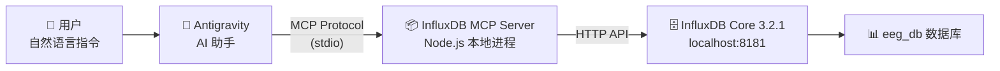

# InfluxDB MCP Server 接入完整指南

## 背景

MCP（Model Context Protocol，模型上下文协议）是一种让 AI 助手直接连接外部工具和数据源的标准协议。通过接入 InfluxDB MCP Server，AI 助手可以直接对 InfluxDB 数据库执行操作，包括查询数据、写入数据、管理数据库等，无需用户手动编写 SQL 或使用 CLI。

## 环境前提

| 项目 | 值 |
|------|-----|
| 操作系统 | Windows |
| InfluxDB 版本 | Core 3.2.1 |
| InfluxDB 启动方式 | `influxdb3.exe serve --without-auth`（无认证模式） |
| InfluxDB 地址 | `http://localhost:8181/` |
| Node.js 版本 | v22.20.0 |
| npm 版本 | v9+ |

## 实现步骤

### 第 1 步：克隆 InfluxDB MCP Server 源码

> [!NOTE]
> InfluxDB MCP Server 的 npm 包（`@influxdata/influxdb3-mcp-server`）截至目前**尚未正式发布到 npm registry**。因此不能使用 `npx` 直接运行，需要从 GitHub 克隆源码并本地构建。

```bash
cd [你想要存放的位置]
git clone https://github.com/influxdata/influxdb3_mcp_server.git
```

这会在项目目录下创建 `influxdb3_mcp_server` 文件夹。

**官方仓库地址**: https://github.com/influxdata/influxdb3_mcp_server

---

### 第 2 步：安装依赖

```bash
cd 【你刚才存放的位置】\influxdb3_mcp_server
npm install
```

输出示例：
```
added 316 packages, and audited 317 packages in 4s
```

---

### 第 3 步：构建项目

```bash
npm run build
```

输出示例：
```
> influxdb-mcp-server@1.3.0 build
> tsc
```

构建完成后会生成 `build/` 目录，核心入口文件为 `build/index.js`。

---

### 第 4 步：配置的 MCP 配置文件

编辑全局 MCP 配置文件：
写入以下内容：

```json
{
  "mcpServers": {
    "influxdb": {
      "command": "node",
      "args": ["【你刚才存放的位置】\influxdb3_mcp_server\build\index.js"],
      "env": {
        "INFLUX_DB_INSTANCE_URL": "http://localhost:8181/",
        "INFLUX_DB_TOKEN": "noauth",
        "INFLUX_DB_PRODUCT_TYPE": "core"
      }
    }
  }
}
```

#### 配置字段说明

| 字段 | 说明 |
|------|------|
| `command` | 使用 `node` 运行构建后的 JS 文件 |
| `args` | 指向本地构建的 MCP Server 入口文件 `build/index.js` 的**绝对路径** |
| `INFLUX_DB_INSTANCE_URL` | InfluxDB 实例的访问地址 |
| `INFLUX_DB_TOKEN` | InfluxDB 的认证 Token。由于使用 `--without-auth` 模式启动，实际不需要认证，但 **MCP Server 代码校验要求此字段不能为空**，所以填入任意占位符如 `"noauth"` |
| `INFLUX_DB_PRODUCT_TYPE` | InfluxDB 的产品类型，可选值：`core`、`enterprise`、`cloud-serverless`、`cloud-dedicated`、`clustered` |

> [!WARNING]
> `INFLUX_DB_TOKEN` 即使在无认证模式下也**不能留空**（`""`），否则 MCP Server 启动时会报错：
> ```
> Configuration validation failed: INFLUX_DB_TOKEN is required for core/enterprise
> ```
> 填写任意非空字符串即可绕过校验。


### 第 5 步：验证连接

在对话中直接让 AI 执行 InfluxDB 操作即可验证，例如：

- "帮我查看 InfluxDB 中有哪些数据库"
- "查看 eeg_db 里有哪些表"
- "查询 kaggle_eeg 表的前 10 条数据"

验证结果：
```
✅ 成功列出数据库：_internal, eeg_db
✅ 成功列出 eeg_db 中的 4 张表：timeseriesraw, timeseriesfilt, avg_band_power, kaggle_eeg
```

---

## 接入后可用的 MCP 工具

接入成功后，AI 助手可以使用以下工具操作 InfluxDB：

| 工具 | 功能 |
|------|------|
| `list_databases` | 列出所有数据库 |
| `create_database` | 创建新数据库 |
| `delete_database` | 删除数据库 |
| `get_measurements` | 查看数据库中的所有表 |
| `get_measurement_schema` | 查看表的字段结构（列名、类型） |
| `execute_query` | 执行 SQL 查询 |
| `write_line_protocol` | 使用 Line Protocol 写入数据 |
| `health_check` | 检查 InfluxDB 连接状态 |
| `load_database_context` | 加载自定义数据库上下文说明 |
| `get_help` | 获取帮助和故障排除指南 |

## 架构示意



## 踩坑记录

### 坑 1：npm 包未发布
- **现象**：使用 `npx -y @influxdata/influxdb3-mcp-server` 报 404 Not Found
- **原因**：官方尚未将此包发布到 npm registry
- **解决**：从 GitHub 克隆源码 → `npm install` → `npm run build` → 用 `node` 直接运行 `build/index.js`

### 坑 2：Token 不能为空
- **现象**：`INFLUX_DB_TOKEN` 设为空字符串后，MCP Server 启动报错 `Configuration validation failed`
- **原因**：MCP Server 源码中的 `validateConfig()` 函数强制校验 Token 非空
- **解决**：填入任意非空占位符，如 `"noauth"`

## 参考资料
- [InfluxDB MCP Server 官方仓库](https://github.com/influxdata/influxdb3_mcp_server)
- [MCP 协议官方文档](https://modelcontextprotocol.io)
