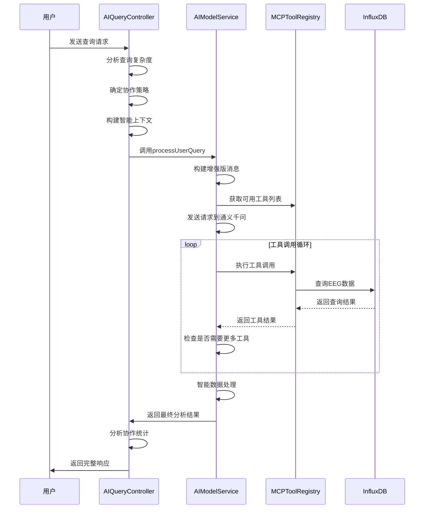

# 脑电数据分析系统 - AI大模型集成MCP服务功能说明文档

## 1. 系统概述

本系统是基于OpenBCI_GUI v6.0.0 beta.1版本的AI增强型脑电数据分析平台，集成通义千问-Max大模型和完整的MCP（Model Control Protocol）工具协作服务。系统通过UDP协议接收三种类型的脑电数据流：TimeSeriesRaw（原始时间序列）、TimeSeriesFilt（滤波时间序列）和AvgBandPower（平均频段功率），使用InfluxDB 3.2.1作为时序数据库，提供智能化的脑电数据分析和科研支持。

### 1.1 核心技术架构

- **AI大模型**：通义千问-Max，支持智能工具调用和多轮对话
- **MCP工具协议**：15个专业EEG分析工具的完整集成
- **数据处理**：Spring Boot 3.x + InfluxDB 3.2.1时序数据库
- **智能协作**：自适应工具选择、多工具协同分析
- **会话管理**：完整的对话历史记录和上下文保持

## 2. 系统架构组件

### 2.1 AI模型服务层（AIModelService.java）

**类职责**：作为系统的AI大脑，负责与通义千问API交互、MCP工具调用协调、智能分析决策和多轮对话管理。

#### 核心方法功能

**`processUserQuery(Long userId, String userQuery, Map<String, Object> context)`**

- **功能**：处理用户查询并智能调用MCP工具的核心方法

- 智能决策流程

  ：

  1. 构建增强版消息列表，包含完整的工具介绍
  2. 获取所有可用的MCP工具列表（15个核心工具）
  3. 构建增强版聊天完成请求
  4. 处理AI对话流程，支持多轮工具调用

```java
public Mono<AIResponse> processUserQuery(Long userId, String userQuery, Map<String, Object> context) {
    return Mono.fromCallable(() -> {
        log.info("开始处理用户查询 - 用户ID: {}, 查询: {}, MCP工具集成: 可用", userId, userQuery);

        try {
            // 1. 构建增强版消息列表 - 包含完整的工具介绍
            List<Map<String, Object>> messages = buildEnhancedMessages(userQuery, context, userId);

            // 2. 获取完整的MCP工具列表
            List<Map<String, Object>> availableTools = mcpToolRegistry.getAllToolsForAI();
            
            // 3. 构建增强版请求
            Map<String, Object> requestBody = buildEnhancedChatCompletionRequest(messages, availableTools);

            // 4. 发送请求并处理响应 - 支持多轮工具调用
            return processEnhancedAIConversation(userId, requestBody, context, 0);
        } catch (Exception e) {
            log.error("处理用户查询时出错 - 用户ID: {}", userId, e);
            return new AIResponse(false, "处理查询时出错: " + e.getMessage(), null, null);
        }
    }).flatMap(response -> Mono.just(response));
}
```

**`processEnhancedAIConversation()`** - 增强版AI对话处理

- **功能**：处理AI与工具的多轮交互，支持复杂的工具协作场景
- **错误处理**：实现指数退避重试策略，支持网络异常恢复
- **递归控制**：防止工具调用无限循环，最大调用次数可配置

```java
private AIResponse processEnhancedAIConversation(Long userId, Map<String, Object> requestBody,
                                                 Map<String, Object> context, int recursionDepth) {
    if (recursionDepth >= aiConfig.getMaxToolCalls()) {
        log.warn("达到最大工具调用次数限制: {} - 用户ID: {}", aiConfig.getMaxToolCalls(), userId);
        return new AIResponse(false, "已达到最大工具调用次数限制", null, null);
    }

    // 网络异常重试机制 - 增强版
    int maxRetries = aiConfig.getMaxRetries();
    long baseDelay = 2000; // 2秒基础延迟

    for (int attempt = 1; attempt <= maxRetries; attempt++) {
        try {
            // 根据尝试次数调整超时时间
            int timeoutSeconds = aiConfig.getTimeout() + (attempt - 1) * 30;

            // 发送请求到通义千问 - 增强版错误处理
            String response = webClient.post()
                    .uri("/chat/completions")
                    .bodyValue(requestBody)
                    .retrieve()
                    .bodyToMono(String.class)
                    .timeout(java.time.Duration.ofSeconds(timeoutSeconds))
                    .block();

            // 解析响应并处理工具调用
            JsonNode responseNode = objectMapper.readTree(response);
            JsonNode message = responseNode.get("choices").get(0).get("message");
            
            JsonNode toolCalls = message.get("tool_calls");
            if (toolCalls != null && toolCalls.size() > 0) {
                return processToolCallsAndContinue(userId, toolCalls, requestBody, context,
                        responseNode.get("usage"), recursionDepth);
            } else {
                String content = message.get("content").asText();
                return new AIResponse(true, content, null, responseNode.get("usage"));
            }
        } catch (Exception e) {
            // 实现指数退避重试
            if (attempt < maxRetries) {
                long delay = baseDelay * (long) Math.pow(2, attempt - 1);
                try {
                    Thread.sleep(delay);
                } catch (InterruptedException ie) {
                    Thread.currentThread().interrupt();
                    return new AIResponse(false, "重试被中断", null, null);
                }
            }
        }
    }
    return new AIResponse(false, "所有重试尝试均失败", null, null);
}
```

**`intelligentDataProcessing()`** - 智能数据处理

- **功能**：自动检测和处理大数据量，避免AI模型token限制
- **优化策略**：当工具返回数据超过4MB时，自动启用智能摘要处理
- **数据保护**：确保关键信息不丢失，提供完整的数据处理透明度

```java
private List<ToolCallResult> intelligentDataProcessing(Long userId, List<ToolCallResult> originalResults,
                                                       Map<String, Object> context) {
    List<ToolCallResult> processedResults = new ArrayList<>();

    for (ToolCallResult result : originalResults) {
        try {
            // 检测数据大小
            String resultJson = convertToolResultToJson(result.result());
            int dataSize = resultJson.getBytes("UTF-8").length;

            // 定义大数据阈值：4MB (考虑到API限制是6MB，留出安全边界)
            int largeDateThreshold = 4 * 1024 * 1024; // 4MB

            if (dataSize > largeDateThreshold) {
                log.warn("检测到大数据量工具结果 - 工具: {}, 大小: {} MB, 启动智能摘要处理",
                        result.functionName(), dataSize / (1024.0 * 1024.0));

                // 使用摘要工具处理大数据
                Object summarizedResult = processLargeDataWithSummary(userId, result, context);
                processedResults.add(new ToolCallResult(result.toolId(), result.functionName(),
                        result.arguments(), summarizedResult));
            } else {
                // 小数据量直接使用原始结果
                processedResults.add(result);
            }
        } catch (Exception e) {
            log.error("处理工具结果时出错 - 工具: {}", result.functionName(), e);
        }
    }
    return processedResults;
}
```

### 2.2 MCP工具注册表（MCPToolRegistry.java）

**类职责**：管理和执行15个专业EEG分析工具，提供完整的脑电数据分析能力，支持科研级数据透明度和学术标准分析。

#### 15个核心MCP工具详细功能说明

**1. getActiveSessionContext - 智能实时会话状态分析**

```java
private Object executeGetActiveSessionContext(Long userId, Map<String, Object> arguments, Map<String, Object> context) {
    try {
        log.info("执行getActiveSessionContext - 用户ID: {}", userId);
        Boolean includeDataStats = getBooleanArgument(arguments, "includeDataStats", true);

        Map<String, Object> result = new HashMap<>();
        result.put("userId", userId);
        result.put("queryTime", LocalDateTime.now().format(DateTimeFormatter.ISO_LOCAL_DATE_TIME));

        // 获取活跃会话
        Optional<EEGSession> activeSession = sessionService.getActiveSession(userId);
        if (activeSession.isPresent()) {
            EEGSession session = activeSession.get();
            Map<String, Object> sessionContext = buildSessionContextInfo(session);

            // 添加实时状态信息
            sessionContext.put("isCurrentlyActive", true);
            sessionContext.put("realTimeDuration", session.calculateDurationSeconds());
            sessionContext.put("streamStatuses", Map.of(
                    "rawStream", session.getRawStreamStatus().toString(),
                    "filtStream", session.getFiltStreamStatus().toString(),
                    "bandStream", session.getBandStreamStatus().toString()
            ));

            result.put("hasActiveSession", true);
            result.put("activeSession", sessionContext);

            // 如果需要包含数据统计
            if (includeDataStats) {
                result.put("realtimeDataStats", generateRealtimeDataStats(userId, session));
            }
        } else {
            result.put("hasActiveSession", false);
            // 获取最新已完成会话作为参考
            Optional<EEGSession> latestSession = sessionService.getUserLatestCompletedSession(userId);
            if (latestSession.isPresent()) {
                result.put("latestCompletedSession", buildSessionContextInfo(latestSession.get()));
            }
        }

        return result;
    } catch (Exception e) {
        log.error("获取活跃会话上下文失败 - 用户ID: {}", userId, e);
        return Map.of("error", "获取活跃会话上下文失败: " + e.getMessage(), "userId", userId);
    }
}
```

- **核心功能**：智能识别用户当前正在进行的EEG数据采集会话
- **实时监控**：提供会话状态、数据流状态、实时持续时间等关键信息
- **数据统计**：可选包含实时数据传输统计，支持三种数据流的状态监控
- **使用场景**：用户询问"我现在的会话状态如何？"、"当前数据采集情况如何？"

**2. queryLatestBandPowerData - 专业频域数据查询分析**

```java
private Object executeQueryLatestBandPowerData(Long userId, Map<String, Object> arguments, Map<String, Object> context) {
    try {
        log.info("执行queryLatestBandPowerData - 用户ID: {} (透明化科研版本)", userId);

        Integer limit = getIntegerArgument(arguments, "limit", 10);
        Boolean groupByTime = getBooleanArgument(arguments, "groupByTime", true);
        List<String> bands = parseBandsArgument(arguments.get("bands"));

        TimeRange timeRange = parseTimeRange(userId, arguments);
        if (timeRange.hasError) {
            return Map.of("error", timeRange.errorMessage);
        }

        // 构建完全透明的SQL查询
        StringBuilder sqlBuilder = new StringBuilder();
        sqlBuilder.append("SELECT ")
                .append("time, ")
                .append("band, ")
                .append("value, ")
                .append("user_id ")  // 明确显示用户ID，增加透明度
                .append("FROM avg_band_power ");

        sqlBuilder.append("WHERE user_id = '").append(userId).append("' ");
        sqlBuilder.append("AND time >= '").append(timeRange.startTime).append("' ");
        sqlBuilder.append("AND time <= '").append(timeRange.endTime).append("' ");

        // 频段筛选（如果指定）
        if (bands != null && !bands.isEmpty()) {
            sqlBuilder.append("AND band IN (");
            for (int i = 0; i < bands.size(); i++) {
                if (i > 0) sqlBuilder.append(", ");
                sqlBuilder.append("'").append(bands.get(i)).append("'");
            }
            sqlBuilder.append(") ");
        }

        String executedSQL = sqlBuilder.toString();
        log.info("执行频谱数据查询SQL: {}", executedSQL);

        // 执行查询并获取原始数据
        String rawDataResult = influxDBService.queryData(executedSQL, "json").block();

        Map<String, Object> result = new HashMap<>();
        result.put("success", true);
        result.put("dataType", "frequency_band_power_analysis");
        result.put("methodology", "Welch_Power_Spectral_Density_Estimation");

        // 查询透明度信息
        Map<String, Object> queryTransparency = new HashMap<>();
        queryTransparency.put("executedSQL", executedSQL);
        queryTransparency.put("dataSourceTable", "avg_band_power");
        result.put("queryTransparency", queryTransparency);

        if (rawDataResult != null && !rawDataResult.trim().isEmpty()) {
            JsonNode dataNode = objectMapper.readTree(rawDataResult);
            if (dataNode.isArray() && dataNode.size() > 0) {
                result.put("rawDataRecordCount", dataNode.size());
                result.put("rawDataSample", extractDataSample(dataNode, 3));

                if (groupByTime) {
                    Map<String, Object> organizedResult = organizeDataByTimePointTransparent(dataNode, limit);
                    result.putAll(organizedResult);
                }

                // 学术级统计分析
                Map<String, Object> statisticalAnalysis = performAcademicStatisticalAnalysis(dataNode);
                result.put("statisticalAnalysis", statisticalAnalysis);

                // EEG频段生物学意义解释
                result.put("frequencyBandInterpretation", getFrequencyBandBiologicalMeaning());
            }
        }

        return result;
    } catch (Exception e) {
        log.error("查询最新频谱数据失败 - 用户ID: {}", userId, e);
        return Map.of("error", "查询频谱数据失败: " + e.getMessage(), "userId", userId);
    }
}
```

- **核心功能**：查询和分析最新的EEG频段功率数据，基于Welch功率谱密度估计
- **科研透明度**：提供完整的SQL查询、数据来源、计算方法说明
- **频段分析**：支持Delta、Theta、Alpha、Beta、Gamma五个经典频段的生物学意义解释
- **数据组织**：智能按时间点组织数据，提供统计分析和原始数据样本

**3. generateComprehensiveSessionSummary - 大数据智能摘要分析**

- **核心功能**：针对大数据量会话生成多层次、多维度的数据摘要
- **优化算法**：采用分层采样和聚合算法避免内存溢出，适合处理长时间记录的EEG数据
- **分析维度**：包括频域、时域、空间和质量分析，支持可配置的分析级别

**4. getSessionDetails - 精确会话信息获取**

```java
private Object executeGetSessionDetails(Long userId, Map<String, Object> arguments, Map<String, Object> context) {
    try {
        Long sessionId = getLongArgument(arguments, "sessionId");
        log.info("执行getSessionDetails - 用户ID: {}, 会话ID: {}", userId, sessionId);

        List<EEGSession> userSessions = sessionService.getUserSessionHistory(userId, 1000);
        Optional<EEGSession> targetSession = userSessions.stream()
                .filter(session -> session.getId().equals(sessionId))
                .findFirst();

        if (targetSession.isEmpty()) {
            return Map.of("error", "会话ID " + sessionId + " 不存在或无权访问");
        }

        EEGSession session = targetSession.get();
        Map<String, Object> sessionDetails = new HashMap<>();
        
        // 基础会话信息
        sessionDetails.put("sessionId", session.getId());
        sessionDetails.put("userId", session.getUserId());
        sessionDetails.put("status", session.getSessionStatus().toString());
        
        // 精确时间信息
        sessionDetails.put("startTimeUtc", session.getSessionStartTimeUtc().format(DateTimeFormatter.ISO_LOCAL_DATE_TIME));
        if (session.getSessionEndTimeUtc() != null) {
            sessionDetails.put("endTimeUtc", session.getSessionEndTimeUtc().format(DateTimeFormatter.ISO_LOCAL_DATE_TIME));
            sessionDetails.put("isCompleted", true);
        }
        
        long durationSeconds = session.calculateDurationSeconds();
        sessionDetails.put("durationSeconds", durationSeconds);
        sessionDetails.put("durationFormatted", formatDuration(durationSeconds));

        // 数据流详细统计
        Map<String, Object> dataStreams = new HashMap<>();
        // Raw数据流
        Map<String, Object> rawStream = new HashMap<>();
        rawStream.put("totalPackets", session.getRawStreamTotalPackets() != null ? session.getRawStreamTotalPackets() : 0);
        rawStream.put("status", session.getRawStreamStatus() != null ? session.getRawStreamStatus().toString() : "UNKNOWN");
        dataStreams.put("raw", rawStream);
        
        sessionDetails.put("dataStreams", dataStreams);
        
        return sessionDetails;
    } catch (Exception e) {
        log.error("获取会话详情失败 - 用户ID: {}", userId, e);
        return Map.of("error", "获取会话详情失败: " + e.getMessage());
    }
}
```

- **核心功能**：根据会话ID获取特定EEG数据会话的详细信息
- **详细统计**：包括精确的开始时间、结束时间、持续时长、数据包统计
- **多数据流**：分别统计Raw、Filtered、BandPower三种数据流的传输状态

**5. monitorSignalQuality - 实时信号质量监测**

```java
private Object executeMonitorSignalQuality(Long userId, Map<String, Object> arguments, Map<String, Object> context) {
    try {
        log.info("执行增强版monitorSignalQuality - 用户ID: {} (基于PSD的现代质量评估)", userId);

        Integer timeWindow = getIntegerArgument(arguments, "timeWindow", 30);
        List<Integer> channels = parseChannelsArgument(arguments.get("channels"));

        EEGSession targetSession = getTargetSession(userId, arguments);
        if (targetSession == null) {
            return Map.of("error", "未找到指定的会话或活跃会话");
        }

        // 计算精确的监测时间范围
        LocalDateTime endTime = targetSession.getSessionEndTimeUtc() != null ?
                targetSession.getSessionEndTimeUtc() : LocalDateTime.now();
        LocalDateTime startTime = endTime.minusSeconds(timeWindow);

        // 增强版SQL查询 - 获取更多数据用于PSD分析
        StringBuilder qualitySQL = new StringBuilder();
        qualitySQL.append("SELECT channel, value, time, user_id ");
        qualitySQL.append("FROM timeseriesfilt ");
        qualitySQL.append("WHERE user_id = '").append(userId).append("' ");
        qualitySQL.append("AND time >= '").append(startTime.format(DateTimeFormatter.ISO_LOCAL_DATE_TIME).replace("T", " ")).append("' ");
        qualitySQL.append("ORDER BY channel, time DESC LIMIT 20000"); // 增加数据量用于PSD计算

        String qualityResult = influxDBService.queryData(qualitySQL.toString(), "json").block();

        Map<String, Object> result = new HashMap<>();
        result.put("success", true);
        result.put("analysisType", "Enhanced_EEG_Signal_Quality_Assessment_v2");
        result.put("methodology", "Power_Spectral_Density_Based_Quality_Metrics");

        if (qualityResult != null && !qualityResult.trim().isEmpty()) {
            JsonNode qualityNode = objectMapper.readTree(qualityResult);
            if (qualityNode.isArray() && qualityNode.size() > 0) {
                // 增强版质量分析 - 基于PSD的方法
                Map<String, Object> qualityAssessment = performEnhancedPSDQualityAnalysis(qualityNode);
                result.put("qualityAssessment", qualityAssessment);

                // 现代EEG质量标准
                result.put("qualityStandards", getModernEEGQualityStandards());
            }
        }

        return result;
    } catch (Exception e) {
        log.error("增强版信号质量监测失败 - 用户ID: {}", userId, e);
        return Map.of("error", "信号质量监测失败: " + e.getMessage());
    }
}
```

- **核心功能**：基于现代EEG质量评估标准进行实时信号质量监测
- **PSD分析**：使用功率谱密度方法评估信号质量，适合OpenBCI合成数据特征
- **多维度评估**：包括SNR、稳定性、幅度合理性、频域质量等综合指标
- **IEEE标准**：遵循IEEE神经技术标准，提供专业级质量评估

**6. getUserStatistics - 用户数据统计洞察**

- **核心功能**：查询用户的总体使用统计，包括总会话数、平均时长、数据量等
- **统计维度**：总会话数、完成率、数据包统计、时长分析
- **洞察生成**：自动计算完成率、平均数据包数等关键指标

**7. queryRawEEGData - 原始EEG时序数据查询**

```java
private Object executeQueryEEGDataTransparent(Long userId, Map<String, Object> arguments, 
                                               Map<String, Object> context, String dataType) {
    try {
        String tableName = "raw".equals(dataType) ? "timeseriesraw" : "timeseriesfilt";
        String analysisType = "raw".equals(dataType) ? "Raw_EEG_Time_Series" : "Filtered_EEG_Time_Series";

        // 学术级数据量评估
        int channelCount = (channels != null && !channels.isEmpty()) ? channels.size() : 8;
        int baseLimit = limit * channelCount;
        int maxLimit = calculateScientificDataLimit(limit, channelCount);
        int actualLimit = Math.min(baseLimit, maxLimit);

        // 构建完全透明的查询
        StringBuilder sqlBuilder = new StringBuilder();
        sqlBuilder.append("SELECT time, channel, value, user_id ");
        sqlBuilder.append("FROM ").append(tableName).append(" ");
        sqlBuilder.append("WHERE user_id = '").append(userId).append("' ");
        // 添加时间和通道筛选条件...

        String rawData = influxDBService.queryData(sqlBuilder.toString(), "json").block();

        Map<String, Object> result = new HashMap<>();
        result.put("success", true);
        result.put("dataType", analysisType);
        result.put("methodology", "raw".equals(dataType) ? 
                "Direct_Time_Series_Analysis" : "Bandpass_Filtered_Time_Series_Analysis");

        // 查询透明度信息
        result.put("queryTransparency", Map.of(
                "executedSQL", sqlBuilder.toString(),
                "dataSourceTable", tableName,
                "samplingParameters", Map.of(
                        "estimatedSamplingRate", "~250Hz (OpenBCI Synthetic)",
                        "nyquistFrequency", "125Hz",
                        "timeResolution", "4ms per sample",
                        "amplitudeUnit", "microvolts (μV)"
                )
        ));

        if (rawData != null && !rawData.trim().isEmpty()) {
            JsonNode dataNode = objectMapper.readTree(rawData);
            result.put("retrievedSampleCount", dataNode.size());
            result.put("dataSample", extractDataSample(dataNode, 5));
            
            // 时间序列统计分析
            Map<String, Object> timeSeriesAnalysis = performTimeSeriesStatisticalAnalysis(dataNode);
            result.put("timeSeriesAnalysis", timeSeriesAnalysis);
        }

        return result;
    } catch (Exception e) {
        log.error("查询{}EEG数据失败 - 用户ID: {}", dataType, userId, e);
        return Map.of("error", "查询" + dataType + "EEG数据失败: " + e.getMessage());
    }
}
```

- **核心功能**：查询原始EEG时间序列数据，提供完整的数据处理透明度
- **采样参数**：明确显示采样率、时间分辨率、幅度单位等技术规格
- **时序分析**：提供自相关、趋势分析、平稳性评估等时间序列特性

**8. queryFilteredEEGData - 滤波EEG时序数据查询**

- **核心功能**：查询经过滤波处理的EEG数据，降噪后更适合分析
- **滤波透明度**：提供完整的滤波处理说明、信号处理方法说明
- **质量提升**：展示滤波前后的信号质量对比和滤波效果分析

**9. assessSessionDataVolume - 数据量智能评估**

```java
private Object executeAssessSessionDataVolume(Long userId, Map<String, Object> arguments, Map<String, Object> context) {
    try {
        Long sessionId = getLongArgument(arguments, "sessionId");
        Boolean includeRecommendations = getBooleanArgument(arguments, "includeRecommendations", true);

        // 评估数据量
        String rawCountQuery = String.format("""
                SELECT COUNT(*) as record_count, 
                       MIN(time) as first_record,
                       MAX(time) as last_record,
                       COUNT(DISTINCT channel) as channel_count
                FROM timeseriesraw 
                WHERE user_id = '%s' AND time >= '%s' AND time <= '%s'
                """, userId, startTime, endTime);

        String rawResult = influxDBService.queryData(rawCountQuery, "json").block();

        Map<String, Object> result = new HashMap<>();
        result.put("rawDataAssessment", rawResult);

        // 生成处理建议（如果需要）
        if (includeRecommendations) {
            Map<String, Object> recommendations = generateDataProcessingRecommendations(rawResult, bandResult);
            result.put("processingRecommendations", recommendations);
        }

        return result;
    } catch (Exception e) {
        log.error("评估会话数据量失败 - 用户ID: {}", userId, e);
        return Map.of("error", "评估会话数据量失败: " + e.getMessage());
    }
}
```

- **核心功能**：分析会话的数据量规模，自动选择最优的查询和处理策略
- **智能推荐**：根据数据量提供处理策略建议，避免大数据量导致的性能问题
- **多数据流**：分别评估Raw、Filtered、BandPower三种数据流的规模

**10. compareSessionDataQuality - 多会话质量对比分析**

```java
private Object executeCompareSessionDataQuality(Long userId, Map<String, Object> arguments, Map<String, Object> context) {
    try {
        List<Integer> sessionIds = (List<Integer>) arguments.get("sessionIds");
        if (sessionIds == null || sessionIds.size() < 2) {
            return Map.of("error", "需要至少提供2个会话ID进行对比");
        }

        List<Map<String, Object>> qualityResults = new ArrayList<>();
        for (EEGSession session : targetSessions) {
            Map<String, Object> sessionQuality = analyzeSessionDataQuality(userId, session);
            qualityResults.add(sessionQuality);
        }

        Map<String, Object> result = new HashMap<>();
        result.put("qualityAnalysis", qualityResults);
        result.put("comparison", generateQualityComparison(qualityResults));
        result.put("recommendation", generateQualityRecommendation(qualityResults));

        return result;
    } catch (Exception e) {
        log.error("对比会话数据质量失败 - 用户ID: {}", userId, e);
        return Map.of("error", "对比会话数据质量失败: " + e.getMessage());
    }
}
```

- **核心功能**：对比分析多个EEG会话的信号质量、数据完整性和稳定性
- **质量维度**：信号强度、稳定性、活跃通道数、潜在伪迹等多维度对比
- **智能推荐**：自动找出最稳定的会话，提供质量改进建议

**11. querySessionsByConditions - 条件筛选会话查询**

- **核心功能**：根据持续时间、状态等条件筛选用户的EEG会话
- **复杂筛选**：支持时长范围、会话状态、数据完整性等多重筛选条件
- **特征分析**：自动分析筛选出的会话特征，提供统计洞察

**12. getSessionTechnicalSpecs - 详细技术规格获取**

```java
private Object executeGetSessionTechnicalSpecs(Long userId, Map<String, Object> arguments, Map<String, Object> context) {
    try {
        Long sessionId = getLongArgument(arguments, "sessionId");
        Boolean includeDataSamples = getBooleanArgument(arguments, "includeDataSamples", false);

        Map<String, Object> specs = new HashMap<>();
        
        // 技术规格
        Map<String, Object> technicalSpecs = new HashMap<>();
        technicalSpecs.put("dataSource", "OpenBCI GUI v6.0.0 beta1");
        technicalSpecs.put("boardMode", "SYNTHETIC (algorithmic) 8chan");
        technicalSpecs.put("networkingProtocol", "UDP");
        technicalSpecs.put("estimatedSamplingRate", "~250Hz");
        technicalSpecs.put("channelCount", 8);
        technicalSpecs.put("channelMapping", Map.of(
                "channel1", "Fp1 (左前额)",
                "channel2", "Fp2 (右前额)",
                "channel3", "C3 (左中央)",
                "channel4", "C4 (右中央)",
                "channel5", "P7 (左颞顶)",
                "channel6", "P8 (右颞顶)",
                "channel7", "O1 (左枕叶)",
                "channel8", "O2 (右枕叶)"
        ));
        specs.put("technicalSpecifications", technicalSpecs);

        // 数据流配置
        Map<String, Object> dataStreamConfig = new HashMap<>();
        // Raw、Filtered、BandPower三种数据流的详细配置...
        specs.put("dataStreamConfiguration", dataStreamConfig);

        return specs;
    } catch (Exception e) {
        log.error("获取会话技术规格失败", e);
        return Map.of("error", "获取会话技术规格失败: " + e.getMessage());
    }
}
```

- **核心功能**：获取EEG会话的完整技术参数，包括采样率、通道配置、数据流状态
- **设备信息**：OpenBCI技术规格、通道映射、网络协议等详细信息
- **数据流状态**：三种数据流的端口、状态、数据包统计等技术细节

**13. getSessionHistory - 完整历史记录管理**

- **核心功能**：获取用户完整的EEG会话历史，支持排序、筛选和统计分析
- **时间分析**：按时间分布分析用户的数据采集模式
- **趋势识别**：识别用户的使用习惯和数据质量趋势

**14. executeCustomQuery - AI自主SQL查询执行**

```java
private Object executeCustomQuery(Long userId, Map<String, Object> arguments, Map<String, Object> context) {
    try {
        String sql = getStringArgument(arguments, "sql", "");
        Integer maxRows = getIntegerArgument(arguments, "maxRows", 1000);

        // 安全检查
        String securityCheck = validateSQLSafety(sql, userId);
        if (securityCheck != null) {
            return Map.of("error", "SQL安全检查失败: " + securityCheck);
        }

        // 添加用户ID过滤（如果SQL中没有包含）
        String safeSql = ensureUserIdFilter(sql, userId);

        // 添加行数限制
        if (!safeSql.toUpperCase().contains("LIMIT")) {
            safeSql += " LIMIT " + Math.min(maxRows, 10000);
        }

        String result = influxDBService.queryData(safeSql, "json").block();

        return Map.of(
                "success", true,
                "dataType", "custom_query",
                "originalSQL", sql,
                "executedSQL", safeSql,
                "data", result,
                "securityNote", "查询已通过安全检查，仅允许SELECT操作且已添加用户ID过滤。"
        );
    } catch (Exception e) {
        log.error("执行自定义SQL查询失败 - 用户ID: {}", userId, e);
        return Map.of("error", "执行自定义SQL查询失败: " + e.getMessage());
    }
}
```

- **核心功能**：AI模型自主执行SQL查询语句，用于复杂的数据分析需求
- **安全保障**：仅允许SELECT操作，强制用户ID过滤，防止SQL注入
- **智能补全**：自动添加安全限制和用户隔离条件

**15. queryDataByTimeRange - 精确时间查询工具**

```java
private Object executeQueryDataByTimeRange(Long userId, Map<String, Object> arguments, Map<String, Object> context) {
    try {
        String dataType = getStringArgument(arguments, "dataType", "bandpower");
        Integer timeWindow = getIntegerArgument(arguments, "timeWindow", 30);
        Integer limit = getIntegerArgument(arguments, "limit", 50);

        // 解析时间参数
        TimeRange timeRange = parseDirectTimeArguments(arguments, timeWindow);
        if (timeRange.hasError) {
            return Map.of("error", timeRange.errorMessage);
        }

        // 根据数据类型选择相应的表和查询
        String tableName;
        switch (dataType.toLowerCase()) {
            case "raw":
                tableName = "timeseriesraw";
                break;
            case "filtered":
                tableName = "timeseriesfilt";
                break;
            case "bandpower":
            default:
                tableName = "avg_band_power";
                break;
        }

        // 构建SQL查询
        StringBuilder sqlBuilder = new StringBuilder();
        if ("avg_band_power".equals(tableName)) {
            sqlBuilder.append("SELECT time, band, value, user_id ");
        } else {
            sqlBuilder.append("SELECT time, channel, value, user_id ");
        }
        sqlBuilder.append("FROM ").append(tableName).append(" ");
        sqlBuilder.append("WHERE user_id = '").append(userId).append("' ");
        sqlBuilder.append("AND time >= '").append(timeRange.startTime).append("' ");
        sqlBuilder.append("AND time <= '").append(timeRange.endTime).append("' ");

        String queryResult = influxDBService.queryData(sqlBuilder.toString(), "json").block();

        Map<String, Object> result = new HashMap<>();
        result.put("success", true);
        result.put("queryType", "direct_time_query");
        result.put("dataType", dataType);

        if (queryResult != null && !queryResult.trim().isEmpty()) {
            JsonNode dataNode = objectMapper.readTree(queryResult);
            if (dataNode.isArray() && dataNode.size() > 0) {
                result.put("dataFound", true);
                result.put("recordCount", dataNode.size());
                result.put("data", queryResult);
                
                // 如果是频段数据，进行智能分析
                if ("avg_band_power".equals(tableName)) {
                    result.put("frequencyAnalysis", analyzeFrequencyData(dataNode));
                }
            }
        }

        return result;
    } catch (Exception e) {
        log.error("按时间范围查询数据失败 - 用户ID: {}", userId, e);
        return Map.of("error", "按时间查询失败: " + e.getMessage());
    }
}
```

- **核心功能**：支持精确时间点或时间范围查询EEG数据
- **多格式支持**：自动识别时间格式，支持ISO标准和自定义格式
- **智能分析**：根据数据类型自动提供相应的分析结果

### 2.3 AI查询控制器（AIQueryController.java）

**类职责**：处理用户AI查询请求，实现智能协作策略分析、复杂度评估、工具选择指导和会话管理。

#### 核心方法功能

**`processUserQuery()` - 核心AI查询处理接口**

```java
@PostMapping("/query")
public Mono<ResponseEntity<Object>> processUserQuery(@RequestBody AIQueryRequest request,
                                                     HttpSession httpSession) {
    Long userId = (Long) httpSession.getAttribute("userId");
    if (userId == null) {
        return Mono.just(ResponseEntity.status(401).body(createErrorResponse("用户未登录", null)));
    }

    String userQuery = request.getQuery().trim();
    String sessionId = request.getSessionId();

    try {
        // 处理会话ID - 如果没有提供，创建新会话
        if (sessionId == null || sessionId.trim().isEmpty()) {
            ConversationSession newSession = conversationHistoryService.createNewConversationSession(userId);
            sessionId = newSession.getSessionId();
        }

        final String finalSessionId = sessionId;

        // 构建增强版智能协作上下文
        Map<String, Object> context = buildEnhancedIntelligentContext(userId, request, userQuery);
        context.put("conversationSessionId", finalSessionId);

        // 调用AI服务处理查询
        return aiModelService.processUserQuery(userId, userQuery, context)
                .map(aiResponse -> {
                    if (aiResponse.success()) {
                        // 分析工具协作情况
                        Map<String, Object> collaborationStats = analyzeEnhancedToolCollaboration(aiResponse);
                        
                        // 保存对话记录到会话
                        saveEnhancedConversationToSession(finalSessionId, userId, userQuery, aiResponse,
                                context, processingDuration, collaborationStats);

                        return ResponseEntity.ok(createEnhancedSuccessResponse(aiResponse, userId, finalSessionId,
                                userQuery, collaborationStats));
                    } else {
                        return ResponseEntity.badRequest()
                                .body(createErrorResponse("AI处理失败: " + aiResponse.content(), userId));
                    }
                });
    } catch (Exception e) {
        log.error("AI查询预处理失败 - 用户ID: {}", userId, e);
        return Mono.just(ResponseEntity.internalServerError()
                .body(createErrorResponse("请求处理失败: " + e.getMessage(), userId)));
    }
}
```

- **会话管理**：自动创建和管理对话会话，支持多轮对话上下文保持
- **智能上下文**：构建包含用户状态、EEG会话信息、工具能力的完整上下文
- **协作分析**：实时分析AI与工具的协作效率和质量

**`buildEnhancedIntelligentContext()` - 智能上下文构建**

```java
private Map<String, Object> buildEnhancedIntelligentContext(Long userId, AIQueryRequest request, String userQuery) {
    Map<String, Object> context = new HashMap<>();

    try {
        // 基础信息
        context.put("userId", userId);
        context.put("currentTime", LocalDateTime.now().format(DateTimeFormatter.ISO_LOCAL_DATE_TIME));

        // 查询复杂度分析
        QueryComplexityAnalysis complexity = analyzeQueryComplexity(userQuery);
        context.put("queryComplexityAnalysis", complexity);

        // 智能协作策略
        CollaborationStrategy collaborationStrategy = determineEnhancedCollaborationStrategy(userQuery, complexity);
        context.put("collaborationStrategy", collaborationStrategy);

        // 场景相关的系统提示词
        String scenario = determineQueryScenario(userQuery);
        context.put("scenarioContext", scenario);

        // MCP工具集成信息
        context.put("mcpToolsReady", true);
        context.put("mcpToolsIntegrated", buildMCPToolsIntegrationInfo());

        // 构建会话上下文
        buildEnhancedSessionContext(userId, request, context, userQuery);

        // 工具选择指导
        buildToolSelectionGuidance(context, collaborationStrategy, userQuery);

        return context;
    } catch (Exception e) {
        log.warn("构建智能协作上下文时出现错误", e);
        context.put("contextError", "构建上下文时出现部分错误: " + e.getMessage());
        return context;
    }
}
```

- **复杂度分析**：自动评估查询复杂度，确定最优工具协作策略
- **场景识别**：智能识别查询场景，选择相应的系统提示词模板
- **工具指导**：提供智能的工具选择和协作建议

**`analyzeQueryComplexity()` - 查询复杂度分析**

```java
private QueryComplexityAnalysis analyzeQueryComplexity(String userQuery) {
    QueryComplexityAnalysis analysis = new QueryComplexityAnalysis();
    String query = userQuery.toLowerCase();

    int complexityScore = 0;

    // 关键词复杂度
    if (containsAny(query, "全面", "详细", "深入", "完整", "综合")) complexityScore += 3;
    if (containsAny(query, "对比", "比较", "分析", "评估")) complexityScore += 2;
    if (containsAny(query, "所有", "全部", "历史", "趋势")) complexityScore += 2;

    // 确定复杂度级别
    if (complexityScore >= 8) {
        analysis.setLevel(ComplexityLevel.VERY_HIGH);
        analysis.setDescription("超高复杂度查询，需要多工具深度协作");
    } else if (complexityScore >= 6) {
        analysis.setLevel(ComplexityLevel.HIGH);
        analysis.setDescription("高复杂度查询，需要多工具协作");
    } else if (complexityScore >= 4) {
        analysis.setLevel(ComplexityLevel.MEDIUM);
        analysis.setDescription("中等复杂度查询，可能需要双工具协作");
    } else {
        analysis.setLevel(ComplexityLevel.LOW);
        analysis.setDescription("低复杂度查询，单工具可能足够");
    }

    return analysis;
}
```

- **智能评分**：基于关键词、语义特征评估查询复杂度
- **策略映射**：复杂度直接影响工具选择和协作模式
- **透明分析**：提供详细的复杂度分析和推理过程

### 2.4 AI模型配置（AIModelConfig.java）

**类职责**：管理AI大模型的配置参数、系统提示词、场景识别和透明化设置。

#### 核心配置特性

**数据透明化系统提示词**

```java
private String systemPrompt = """
        你是一位世界顶级的脑电数据分析专家，专门从事OpenBCI EEG信号分析和神经科学研究。

        【绝对数据透明化原则 - 这是你的核心行为准则】
        
        🔬 **绝对禁止数据虚构**：
        - 你绝对不会编造、虚构或假设任何EEG数据值
        - 每一个数值、统计结果、计算结果都必须来自真实的数据库查询
        - 如果没有实际数据支撑，你会明确告诉用户"根据当前可获取的数据，我无法提供这项分析"

        📊 **完全分析透明化**：
        - 你的每一个结论都必须明确说明数据来源和计算过程
        - 当你说"通道1的标准差为X"时，你必须说明这个标准差是基于哪个时间段的多少个数据点计算得出的
        - 你会主动展示关键的原始数据样本，让用户看到分析的数据基础

        🧠 **神经科学专业基础**：
        **EEG频段生物学意义**：
        - Delta (0.5-4Hz): 深度睡眠，异常时可能提示脑损伤
        - Theta (4-8Hz): 工作记忆，创造性任务，REM睡眠
        - Alpha (8-13Hz): 放松警觉，默认模式网络，闭眼清醒状态
        - Beta (13-30Hz): 专注状态，执行控制，主动思维
        - Gamma (30-100Hz): 意识统一，特征绑定，高级认知功能
        """;
```

- **数据真实性**：严格禁止AI编造任何数据，确保所有结论基于真实查询结果
- **透明度要求**：强制要求AI说明每个数据的来源、计算过程和统计基础
- **科学标准**：基于IEEE标准和现代神经科学知识提供专业解释

**场景智能识别**

```java
public String recommendScenario(String userQuery) {
    if (userQuery == null) return "default";

    String query = userQuery.toLowerCase();
    Map<String, Integer> scenarioScores = new HashMap<>();

    // 实时监控场景评分
    if (containsAny(query, "当前", "现在", "正在", "实时", "活跃")) {
        scenarioScores.put("real_time_monitoring", scenarioScores.get("real_time_monitoring") + 5);
    }

    // 频域分析场景评分
    if (containsAny(query, "最新", "频谱", "频段", "功率", "alpha", "beta", "theta", "delta", "gamma")) {
        scenarioScores.put("frequency_analysis", scenarioScores.get("frequency_analysis") + 5);
    }

    // 找出得分最高的场景
    return scenarioScores.entrySet().stream()
            .max(Map.Entry.comparingByValue())
            .filter(entry -> entry.getValue() > 0)
            .map(Map.Entry::getKey)
            .orElse("default");
}
```

- **智能匹配**：根据用户查询内容自动识别最适合的分析场景
- **提示词优化**：每个场景对应特定的系统提示词增强
- **专业导向**：确保AI以最专业的方式回应不同类型的查询

## 3. 配置文件说明（application.yml）

### 3.1 核心数据库配置

```yaml
spring:
  datasource:
    url: jdbc:mysql://localhost:3306/eeg_platform?createDatabaseIfNotExist=true&useUnicode=true&characterEncoding=UTF-8&serverTimezone=UTC
    username: root
    password: 123456

influxdb:
  url: http://localhost:8181
  token: apiv3_6hQgoPWltvJPW3a-Pyf116CfbUlMVylHofRF7IcXom5YMXDF4mNUmrq39ccq5SmLncH1k1Z1RgUdGHfgg3caag
```

- **MySQL**：用于用户认证、会话管理、对话历史存储
- **InfluxDB 3.2.1**：专门用于时序EEG数据存储和高效查询
- **时区统一**：强制使用UTC时区确保时间数据一致性

### 3.2 EEG平台核心配置

```yaml
eeg:
  port-pool:
    start: 15001
    end: 65535
    ports-per-user: 3
    reservation-timeout-minutes: 30

  realtime-analysis:
    sample-window-minutes: 2
    min-samples: 10
    analysis-interval-seconds: 30
    enable-auto-start: true
    confidence-threshold: 0.6

  thresholds:
    alpha-relaxed: 0.35
    alpha-deep-relaxed: 0.5
    beta-focused: 0.4
    beta-stressed: 0.6
    theta-creative: 0.3
    delta-drowsy: 0.4
    gamma-alert: 0.4
    gamma-hyperactive: 0.6
```

- **端口池管理**：为每个用户分配3个UDP端口（Raw、Filtered、BandPower）
- **实时分析**：2分钟滑动窗口、30秒分析间隔的实时处理配置
- **状态阈值**：基于神经科学研究的各频段状态判断阈值

### 3.3 MCP服务配置

```yaml
eeg:
  mcp:
    performance:
      max-concurrent-analysis: 10
      summary-timeout: 300
      feature-extraction-timeout: 300
      enable-parallel-processing: true
      data-point-threshold: 500000

    quality-standards:
      min-data-completeness: 0.8
      max-outlier-percentage: 0.1
      min-signal-to-noise-ratio: 2.0
      min-required-channels: 1
      max-artifact-level: 0.2

    ai-integration:
      enable-auto-summarization: true
      default-summary-level: comprehensive
      max-feature-vector-size: 5000
      enable-smart-tool-orchestration: true

    security:
      custom-sql:
        enable: true
        max-query-length: 5000
        timeout-seconds: 300
      access-control:
        enable-user-isolation: true
        max-requests-per-minute: 100
```

- **性能配置**：支持10个并发分析、300秒超时、50万数据点阈值
- **质量标准**：80%数据完整性、2.0最小信噪比等质量要求
- **安全配置**：启用自定义SQL但严格限制，用户隔离保护

### 3.4 AI大模型配置

```yaml
ai:
  tongyi:
    api-key: sk-1f46b1e2693846c4a85db50d5e41460c
    base-url: https://dashscope.aliyuncs.com/compatible-mode/v1
    model: qwen-max

    temperature: 0.1
    max-tokens: 8000
    timeout: 300
    max-retries: 3

    enable-mcp-tools: true
    max-tool-calls: 14
    collaboration-mode: "free"

    collaboration-optimization:
      enable-smart-sequencing: true
      enable-parallel-calls: false
      enable-result-caching: true
      enable-context-sharing: true
      enable-dynamic-strategy: true

    intelligent-decision:
      enable-query-analysis: true
      enable-complexity-assessment: true
      enable-strategy-recommendation: true
      confidence-threshold: 0.3
```

- **API配置**：通义千问-Max模型，8000 token上限，300秒超时
- **工具协作**：启用14个MCP工具，自由协作模式，智能序列化
- **智能决策**：启用查询分析、复杂度评估、策略推荐，0.3置信度阈值

## 4. 核心业务流程

### 4.1 AI工具协作决策流程



### 4.2 工具智能选择流程

1. **查询分析阶段**：
   - 提取关键词和语义特征
   - 评估查询复杂度（VERY_LOW到VERY_HIGH）
   - 识别查询场景（实时监控、频域分析、质量评估等）
2. **策略确定阶段**：
   - 根据复杂度确定工具数量范围（1-10个）
   - 选择执行模式（单一、序列、并行、混合）
   - 生成推荐工具列表
3. **动态调整阶段**：
   - AI根据工具返回结果动态决策
   - 支持最多14轮工具调用
   - 智能数据处理避免token超限

### 4.3 数据透明化保证流程

1. **查询透明度**：每个工具调用都显示完整的SQL查询语句
2. **计算透明度**：所有统计计算都说明数据来源和计算方法
3. **结果透明度**：提供原始数据样本和中间计算结果
4. **方法透明度**：详细说明使用的科学方法和参考标准

## 5. 系统特色功能

### 5.1 智能工具协作

- **自适应选择**：根据查询复杂度自动选择最优工具组合
- **动态调整**：AI在执行过程中根据结果动态调整策略
- **协作优化**：15个工具之间的智能协作和结果整合

### 5.2 大数据智能处理

- **自动检测**：当数据量超过4MB时自动启用智能摘要
- **分层处理**：针对不同数据类型使用不同的摘要策略
- **信息保护**：确保关键信息在数据压缩过程中不丢失

### 5.3 科研级数据透明度

- **绝对真实性**：严格禁止AI编造任何数据或统计结果
- **完整追溯**：每个分析结果都可以追溯到原始数据查询
- **方法公开**：详细说明所有计算方法和科学依据

### 5.4 会话管理与历史记录

- **多轮对话**：支持复杂的多轮对话和上下文保持
- **协作统计**：记录每次查询的工具使用和协作效率
- **历史分析**：支持对话历史的检索和分析

