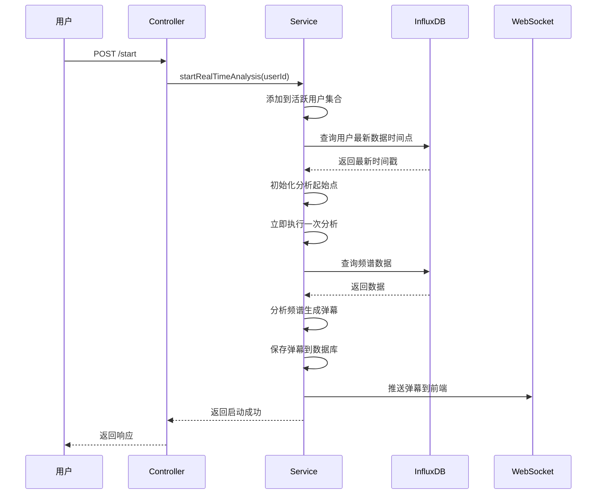
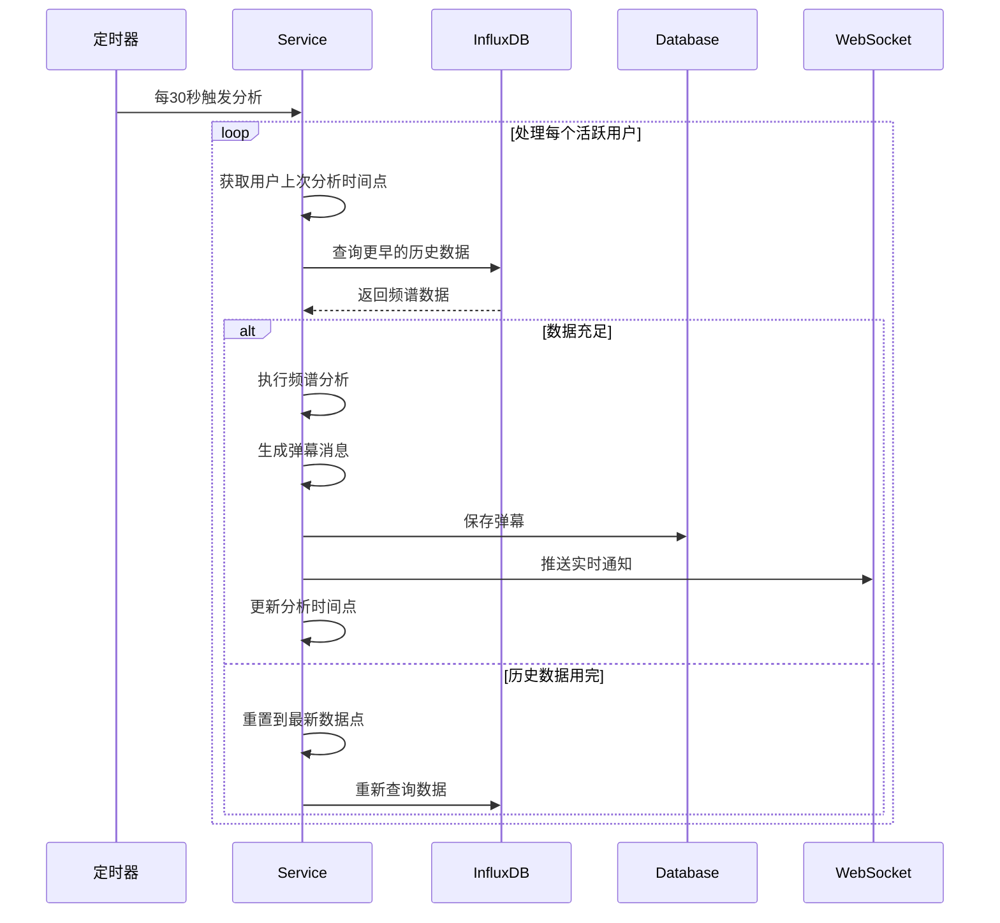
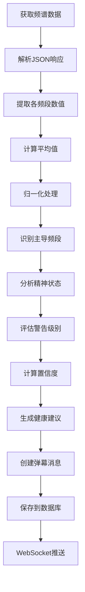
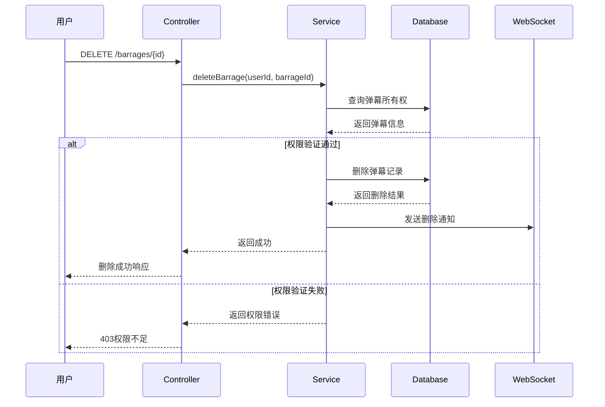

# 脑电数据分析系统 - 实时分析弹幕模块开发需求文档

## 1. 项目背景与目标

### 1.1 项目背景

- **硬件环境：** OpenBCI_GUI v6.0.0 beta.1客户端，SYNTHETIC(algorithmic) 8通道模式
- **数据传输：** UDP协议传输三种脑电数据流（TimeSeriesRaw、TimeSeriesFilt、AvgBandPower）
- **数据存储：** InfluxDB 3.2.1时序数据库存储频谱数据
- **分析目标：** 实时分析AvgBandPower频带功率数据，识别用户精神状态
- **展示创新：** 采用"弹幕"形式展示分析结果，提供直观的用户体验

### 1.2 模块目标

构建创新的实时脑电分析系统，通过科学的频谱分析算法识别用户的精神状态，以弹幕形式实时展示分析结果，为用户提供连续的健康监测、状态提醒和个性化建议，支持科研分析和日常健康管理需求。

## 2. 功能需求规格

### 2.1 实时分析控制需求

**业务需求：**

- 支持启动和停止个人的实时脑电分析
- 实现智能数据获取策略：实时数据 → 历史数据 → 持续采样
- 提供即时分析功能，启动后立即获得分析结果
- 支持多用户并发分析，互不干扰

**技术规格：**

- **启动接口：** `POST /api/realtime-analysis/start`
- **停止接口：** `POST /api/realtime-analysis/stop`
- **即时分析：** `POST /api/realtime-analysis/analyze-now`
- **分析间隔：** 可配置，默认30秒
- **数据窗口：** 可配置，默认2分钟
- **最小样本：** 可配置，默认10个数据点

**响应格式：**

```json
{
  "success": true,
  "message": "实时分析已启动",
  "timestamp": 1699123456789,
  "service": "RealTimeSpectrumAnalysis",
  "userId": 1,
  "analysisActive": true,
  "strategy": "智能数据获取：实时数据 -> 历史数据 -> 持续采样"
}
```

### 2.2 弹幕生成与推送需求

**业务需求：**

- 基于脑电频谱数据生成有意义的弹幕消息
- 实时推送新生成的弹幕到前端
- 支持精神状态识别和健康建议
- 记录完整的分析元数据用于追溯

**技术规格：**

- **状态识别：** 支持10种精神状态（深度放松、专注、紧张等）
- **警告级别：** 4级警告（正常、注意、警告、严重）
- **频谱记录：** 完整记录Alpha、Beta、Theta、Delta、Gamma数值
- **置信度评估：** 基于样本数量和分布均衡性
- **实时推送：** WebSocket通知机制

**弹幕内容格式：**

```json
{
  "id": 123,
  "content": "【专注状态】主导: BETA (置信度: 85.2%) - 当前专注度良好，适合学习工作 [14:30:15 ~ 14:32:15]",
  "primaryState": "FOCUSED",
  "alertLevel": "NORMAL",
  "alphaValue": 12.5,
  "betaValue": 28.7,
  "thetaValue": 8.3,
  "deltaValue": 15.2,
  "gammaValue": 9.8,
  "confidenceScore": 0.852,
  "dominantFrequency": "beta",
  "recommendation": "当前专注度良好，适合学习工作",
  "dataStartTime": "2024-01-15T14:30:15",
  "dataEndTime": "2024-01-15T14:32:15",
  "sampleCount": 45,
  "createdAt": "2024-01-15T14:32:20"
}
```

### 2.3 历史弹幕查询需求

**业务需求：**

- 支持查询用户的历史弹幕记录
- 按时间倒序展示，最新的在前
- 支持分页查询，避免大数据量传输
- 提供完整的弹幕详情信息

**技术规格：**

- **查询接口：** `GET /api/realtime-analysis/barrages`
- **分页参数：** `limit`（默认20，最大100）
- **排序规则：** 按`createdAt`倒序
- **数据完整性：** 包含所有分析字段和元数据

**响应格式：**

```json
{
  "success": true,
  "message": "获取历史弹幕成功",
  "timestamp": 1699123456789,
  "service": "RealTimeSpectrumAnalysis",
  "data": {
    "barrages": [
      {
        "id": 123,
        "content": "【专注状态】主导: BETA...",
        "primaryState": "FOCUSED",
        "alertLevel": "NORMAL",
        "createdAt": "2024-01-15T14:32:20"
      }
    ],
    "total": 15,
    "userId": 1
  }
}
```

### 2.4 弹幕管理需求

**业务需求：**

- 支持删除个人的弹幕记录
- 确保用户只能管理自己的数据
- 删除操作实时通知前端更新
- 提供删除确认和错误处理

**技术规格：**

- **删除接口：** `DELETE /api/realtime-analysis/barrages/{barrageId}`
- **权限验证：** 确保只能删除自己的弹幕
- **事务安全：** 使用数据库事务确保操作原子性
- **实时通知：** WebSocket推送删除通知

## 3. 数据模型需求

### 3.1 弹幕实体设计

**数据表：** `barrage_messages`

**字段规格：**

```sql
CREATE TABLE barrage_messages (
    id BIGINT AUTO_INCREMENT PRIMARY KEY,
    user_id BIGINT NOT NULL,
    content VARCHAR(500) NOT NULL,
    primary_state ENUM('DEEP_RELAXATION', 'RELAXED', 'FOCUSED', 'ALERT', 'STRESSED', 'DROWSY', 'MEDITATIVE', 'CREATIVE', 'HYPERACTIVE', 'UNBALANCED') NOT NULL,
    alert_level ENUM('NORMAL', 'ATTENTION', 'WARNING', 'CRITICAL') NOT NULL,
    
    -- 频谱数据快照
    alpha_value DOUBLE NOT NULL,
    beta_value DOUBLE NOT NULL, 
    theta_value DOUBLE NOT NULL,
    delta_value DOUBLE NOT NULL,
    gamma_value DOUBLE NOT NULL,
    
    -- 分析元数据
    data_start_time DATETIME NOT NULL,
    data_end_time DATETIME NOT NULL,
    sample_count INTEGER NOT NULL,
    confidence_score DOUBLE,
    dominant_frequency VARCHAR(100),
    recommendation VARCHAR(200),
    
    -- 时间戳
    created_at DATETIME NOT NULL DEFAULT CURRENT_TIMESTAMP,
    
    -- 索引
    INDEX idx_user_created (user_id, created_at DESC),
    INDEX idx_user_state (user_id, primary_state),
    INDEX idx_created_time (created_at DESC)
);
```

### 3.2 精神状态枚举设计

**精神状态分类：**

```java
public enum MentalState {
    DEEP_RELAXATION("深度放松"),      // Alpha > 0.5
    RELAXED("放松状态"),              // Alpha > 0.35
    FOCUSED("专注状态"),              // Beta 0.4-0.6
    ALERT("警觉状态"),               // Gamma适度
    STRESSED("紧张状态"),            // Beta > 0.6
    DROWSY("困倦状态"),              // Delta > 0.4
    MEDITATIVE("冥想状态"),          // Theta + Alpha组合
    CREATIVE("创造性状态"),          // Theta主导
    HYPERACTIVE("过度活跃"),         // Gamma > 0.6
    UNBALANCED("状态失衡");          // 分布不均衡
}
```

**警告级别分类：**

```java
public enum AlertLevel {
    NORMAL("正常"),                  // 健康状态
    ATTENTION("注意"),               // 需要关注
    WARNING("警告"),                 // 需要调整
    CRITICAL("严重");                // 需要干预
}
```

### 3.3 分析算法配置

**频段定义：**

- **Delta (δ):** 0.5-4Hz，深度睡眠状态
- **Theta (θ):** 4-8Hz，创造性思维状态
- **Alpha (α):** 8-13Hz，清醒放松状态
- **Beta (β):** 13-30Hz，主动思维状态
- **Gamma (γ):** 30-100Hz，高级认知状态

**状态判断阈值：**

```yaml
mental_state_thresholds:
  deep_relaxation:
    alpha_min: 0.5
  relaxed:
    alpha_min: 0.35
  focused:
    beta_min: 0.4
    beta_max: 0.6
  stressed:
    beta_min: 0.6
  drowsy:
    delta_min: 0.4
  meditative:
    theta_min: 0.3
    alpha_min: 0.2
```

## 4. 技术架构需求

### 4.1 框架要求

- **核心框架：** Spring Boot 3.x
- **数据访问：** Spring Data JPA
- **定时任务：** Spring Scheduling (@Scheduled)
- **异步处理：** Spring Async (@Async)
- **JSON处理：** Jackson ObjectMapper
- **事务管理：** Spring Transaction Management

### 4.2 外部依赖

- **时序数据库：** InfluxDB 3.2.1客户端
- **实时通信：** WebSocket支持
- **数据库：** 兼容JPA的关系型数据库
- **配置管理：** Spring Configuration Properties

### 4.3 性能要求

- **分析延迟：** 数据获取和分析总时长 < 5秒
- **并发支持：** 支持50+用户同时进行实时分析
- **定时精度：** 分析间隔误差 < ±2秒
- **数据吞吐：** 支持每分钟1000+数据点的处理

## 5. 业务流程需求

### 5.1 启动实时分析流程



### 5.2 持续数据采样流程



### 5.3 频谱分析处理流程



### 5.4 弹幕删除管理流程



## 6. API接口设计需求

### 6.1 RESTful API规范

**基础路径：** `/api/realtime-analysis`

**统一响应格式：**

```json
{
  "success": boolean,
  "message": string,
  "timestamp": long,
  "service": "RealTimeSpectrumAnalysis",
  "data": object,
  "error": string (仅在失败时)
}
```

### 6.2 核心接口列表

| 方法   | 路径                    | 功能         | 权限要求   | 请求参数    |
| ------ | ----------------------- | ------------ | ---------- | ----------- |
| POST   | `/start`                | 启动实时分析 | 已登录用户 | 无          |
| POST   | `/stop`                 | 停止实时分析 | 已登录用户 | 无          |
| POST   | `/analyze-now`          | 立即执行分析 | 已登录用户 | 无          |
| GET    | `/barrages`             | 获取历史弹幕 | 已登录用户 | limit(可选) |
| DELETE | `/barrages/{barrageId}` | 删除弹幕     | 弹幕所有者 | barrageId   |

### 6.3 WebSocket事件设计

**事件类型：**

```json
{
  "NEW_BARRAGE": {
    "type": "NEW_BARRAGE",
    "barrage": {弹幕对象},
    "timestamp": 1699123456789
  },
  "BARRAGE_DELETED": {
    "type": "BARRAGE_DELETED", 
    "barrageId": 123,
    "content": "删除的弹幕内容",
    "timestamp": 1699123456789
  },
  "ANALYSIS_ERROR": {
    "type": "ANALYSIS_ERROR",
    "error": "错误信息",
    "timestamp": 1699123456789
  }
}
```

## 7. 算法需求规格

### 7.1 频谱数据处理算法

**数据预处理：**

```java
// 数据清洗和验证
private boolean validateSpectralData(SpectralData data) {
    return data.getSampleCount() >= minSamples && 
           data.getStartTime() != null && 
           data.getEndTime() != null;
}

// 归一化处理消除个体差异
private Map<String, Double> normalizeSpectralData(Map<String, Double> rawData) {
    double totalPower = rawData.values().stream().mapToDouble(Double::doubleValue).sum();
    return rawData.entrySet().stream()
        .collect(Collectors.toMap(
            Map.Entry::getKey,
            entry -> totalPower > 0 ? entry.getValue() / totalPower : 0.0
        ));
}
```

### 7.2 精神状态识别算法

**判断逻辑：**

```java
private MentalState identifyMentalState(Map<String, Double> normalized) {
    double alpha = normalized.getOrDefault("alpha", 0.0);
    double beta = normalized.getOrDefault("beta", 0.0);
    double theta = normalized.getOrDefault("theta", 0.0);
    double delta = normalized.getOrDefault("delta", 0.0);
    double gamma = normalized.getOrDefault("gamma", 0.0);

    // 优先级判断逻辑
    if (delta > 0.4) return MentalState.DROWSY;
    if (theta > 0.3 && alpha > 0.2) return MentalState.MEDITATIVE;
    if (alpha > 0.5) return MentalState.DEEP_RELAXATION;
    if (alpha > 0.35) return MentalState.RELAXED;
    if (beta > 0.6) return MentalState.STRESSED;
    if (beta > 0.4) return MentalState.FOCUSED;
    if (gamma > 0.6) return MentalState.HYPERACTIVE;
    if (gamma > 0.4) return MentalState.ALERT;
    
    return MentalState.UNBALANCED;
}
```

### 7.3 置信度评估算法

**计算公式：**

```java
private double calculateConfidenceScore(int sampleCount, Map<String, Double> normalized) {
    // 样本数量基础分 (0-1)
    double sampleScore = Math.min((double) sampleCount / 100.0, 1.0);
    
    // 分布均衡度分 (0-1)
    double maxValue = normalized.values().stream().mapToDouble(Double::doubleValue).max().orElse(0.0);
    double balanceScore = Math.max(0.2, 1.0 - Math.max(0, maxValue - 0.4));
    
    // 最终置信度 (最低30%)
    return Math.max(0.3, Math.min(1.0, sampleScore * balanceScore));
}
```

## 8. 数据持续采样需求

### 8.1 智能时间管理策略

**核心原理：** 维护每个用户的"最后分析时间点"，实现向历史数据的持续回溯，确保每次分析都获取不同时段的数据。

**时间点管理：**

```java
// 用户分析时间点跟踪
private final ConcurrentHashMap<Long, LocalDateTime> lastAnalysisTimes = new ConcurrentHashMap<>();

// 初始化策略：从最新数据点开始
private void initializeUserAnalysisStartPoint(Long userId) {
    // 查询用户最新数据时间点
    // 如果失败，使用当前时间往前推5分钟作为fallback
}

// 时间推进策略：每次分析后向前推进
private void updateAnalysisTimePoint(Long userId, LocalDateTime analysisEndTime) {
    lastAnalysisTimes.put(userId, analysisEndTime);
}
```

### 8.2 循环采样机制

**数据查询策略：**

```sql
-- 向历史数据回溯查询
SELECT time, band, value FROM avg_band_power 
WHERE user_id = ? AND time < ? 
ORDER BY time DESC 
LIMIT ?
```

**循环重置机制：**

```java
// 历史数据用完后重置到最新数据点
private void resetToLatestData(Long userId) {
    initializeUserAnalysisStartPoint(userId);
    // 确保用户始终有新的分析结果
}
```

## 9. 配置需求

### 9.1 应用配置

```yaml
eeg:
  realtime-analysis:
    # 分析参数
    sample-window-minutes: 2          # 数据采样窗口
    min-samples: 10                   # 最小样本数量
    analysis-interval-seconds: 30     # 分析间隔
    max-concurrent-users: 50          # 最大并发用户
    
    # 置信度参数
    min-confidence-score: 0.3         # 最低置信度
    sample-weight: 0.6                # 样本数量权重
    balance-weight: 0.4               # 分布均衡权重
    
    # 状态识别阈值
    thresholds:
      alpha-relaxed: 0.35
      alpha-deep-relaxation: 0.5
      beta-focused: 0.4
      beta-stressed: 0.6
      theta-meditative: 0.3
      delta-drowsy: 0.4
      gamma-alert: 0.4
      gamma-hyperactive: 0.6
```

### 9.2 数据库配置

```yaml
spring:
  datasource:
    # 数据库连接配置
    
  jpa:
    hibernate:
      ddl-auto: update
    show-sql: false
    properties:
      hibernate:
        format_sql: true
        dialect: org.hibernate.dialect.MySQL8Dialect
        
# InfluxDB配置
influxdb:
  url: http://localhost:8086
  token: your-token
  org: your-org
  bucket: eeg-data
```

## 10. 安全需求

### 10.1 数据访问安全

- **用户隔离：** 所有操作都基于用户ID进行严格过滤
- **权限验证：** 弹幕删除操作验证所有权
- **会话验证：** 基于HttpSession的身份认证
- **SQL注入防护：** 使用参数化查询

### 10.2 数据隐私保护

- **个人数据：** 弹幕内容不包含敏感个人信息
- **数据最小化：** 只收集分析必需的频谱数据
- **删除权利：** 用户可以删除自己的弹幕记录
- **访问控制：** 严格的用户级数据访问控制

### 10.3 系统安全

- **输入验证：** 验证分析参数的合法性
- **资源限制：** 限制单用户的资源使用
- **错误处理：** 安全的错误信息返回
- **日志审计：** 关键操作的详细日志记录

## 11. 性能需求

### 11.1 响应时间要求

- **分析启动：** < 2秒
- **数据查询：** < 3秒（单次InfluxDB查询）
- **频谱分析：** < 1秒（单次分析处理）
- **弹幕生成：** < 500ms
- **WebSocket推送：** < 200ms

### 11.2 并发性能要求

- **同时分析用户：** 支持50+用户
- **定时任务性能：** 30秒内完成所有用户分析
- **数据库连接：** 配置合适的连接池
- **内存使用：** 单用户状态数据 < 1MB

### 11.3 可扩展性要求

- **水平扩展：** 支持多实例部署
- **状态同步：** 分布式环境下的状态管理
- **负载均衡：** WebSocket连接的负载分配
- **缓存策略：** 合理的数据缓存机制

## 12. 监控需求

### 12.1 业务监控

- **活跃用户数：** 实时监控分析用户数量
- **分析成功率：** 统计分析成功和失败比例
- **弹幕生成量：** 每小时/每天的弹幕生成统计
- **状态分布：** 不同精神状态的分布统计

### 12.2 技术监控

- **API响应时间：** 各接口的平均响应时间
- **InfluxDB查询性能：** 数据查询耗时统计
- **WebSocket连接：** 连接数量和推送成功率
- **定时任务执行：** 分析任务的执行时间和成功率

### 12.3 异常监控

- **分析失败：** 频谱分析失败的原因统计
- **数据异常：** 数据获取失败或格式异常
- **推送失败：** WebSocket推送失败统计
- **系统资源：** CPU、内存使用率监控

## 13. 测试需求

### 13.1 单元测试

- **频谱分析算法：** 各种输入数据的分析结果验证
- **状态识别逻辑：** 不同频谱组合的状态判断测试
- **置信度计算：** 置信度算法的准确性测试
- **数据解析：** InfluxDB响应数据的解析测试

### 13.2 集成测试

- **完整分析流程：** 从数据获取到弹幕生成的端到端测试
- **WebSocket推送：** 实时推送功能的集成测试
- **数据库操作：** 弹幕CRUD操作的完整测试
- **定时任务：** 定时分析任务的执行测试

### 13.3 性能测试

- **并发分析：** 多用户同时分析的性能测试
- **数据量测试：** 大量历史数据的查询性能
- **长时间运行：** 连续运行24小时的稳定性测试
- **内存泄漏：** 长期运行的内存使用测试

## 14. 部署需求

### 14.1 环境要求

- **JDK版本：** OpenJDK 17+
- **Spring Boot版本：** 3.x
- **数据库：** MySQL 8.0+ 或 PostgreSQL 13+
- **InfluxDB：** 3.2.1+
- **内存：** 最少4GB可用内存

### 14.2 配置管理

- **环境配置：** 开发、测试、生产环境的配置文件
- **敏感信息：** 使用环境变量管理敏感配置
- **动态配置：** 支持运行时配置参数调整
- **监控配置：** 监控和告警的相关配置

### 14.3 扩展部署

- **容器化：** Docker容器化部署支持
- **集群部署：** 多实例部署的配置指南
- **负载均衡：** 前端负载均衡器配置
- **监控集成：** Prometheus、Grafana监控集成