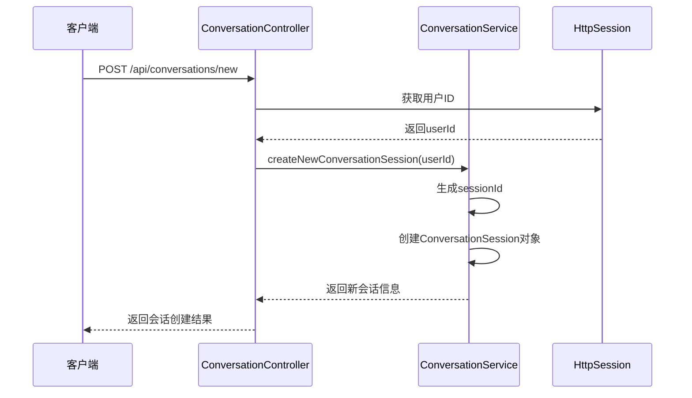
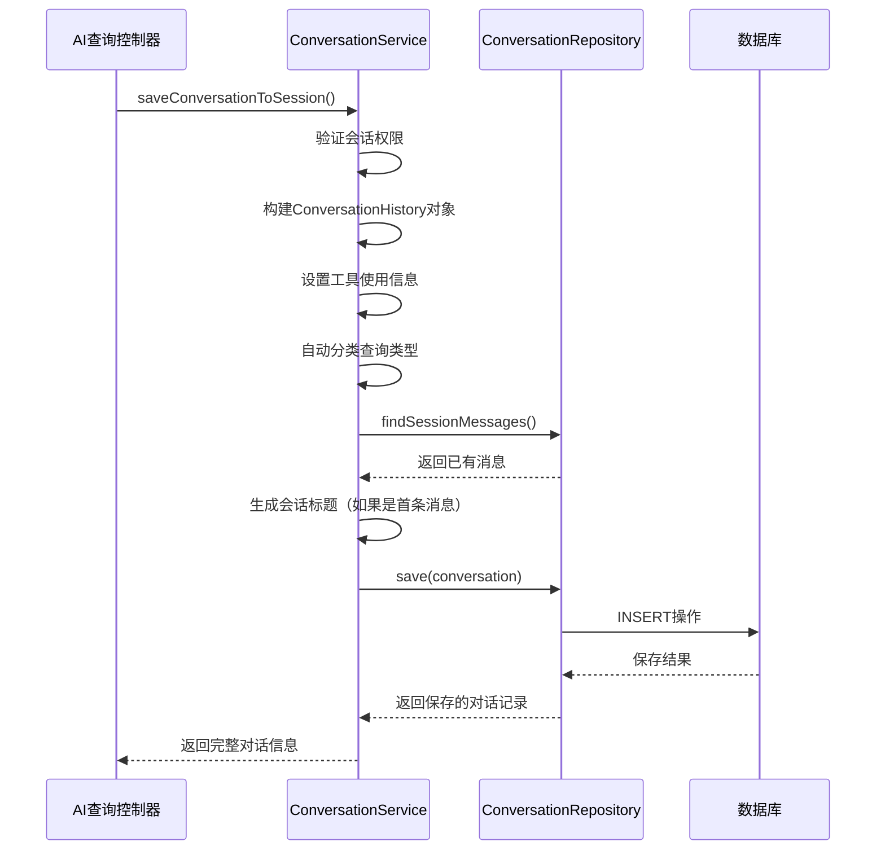
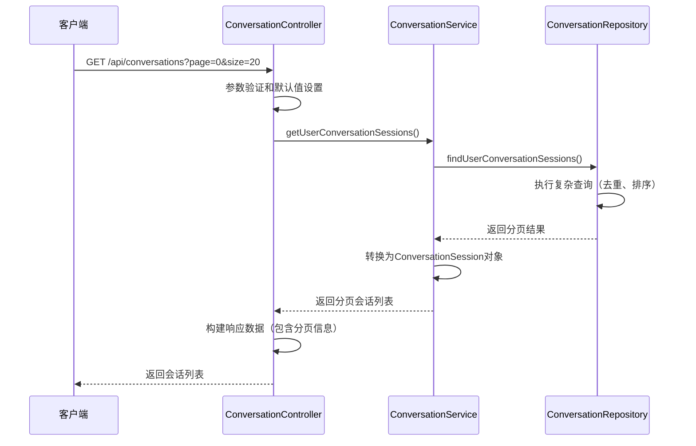
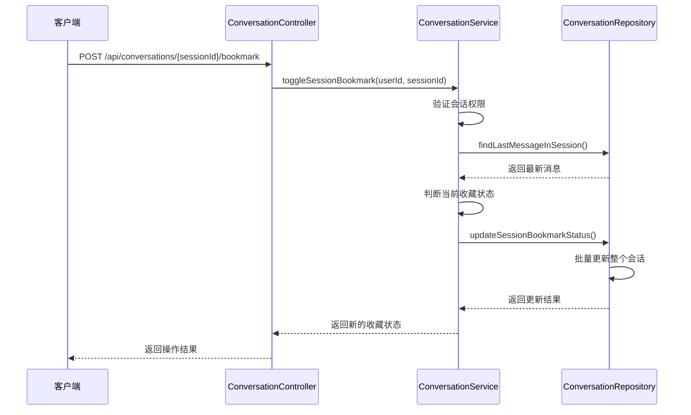

# 脑电数据分析系统 - 对话历史模块开发需求文档

## 1. 项目背景与目标

### 1.1 项目背景

- **硬件环境：** OpenBCI_GUI v6.0.0 beta.1客户端
- **数据传输：** UDP协议传输三种脑电数据流（TimeSeriesRaw、TimeSeriesFilt、AvgBandPower）
- **数据库：** InfluxDB 3.2.1时序数据库存储脑电数据
- **AI集成：** 支持AI大模型与MCP服务工具的集成分析
- **用户系统：** 基于现有用户认证系统的个性化服务

### 1.2 模块目标

构建AI大模型与用户的对话历史管理系统，为用户提供完整的AI交互体验，支持对话会话概念、消息记录管理、收藏功能和统计分析，为脑电数据分析的AI服务提供完整的交互历史追踪。

## 2. 功能需求规格

### 2.1 对话会话管理需求

**业务需求：**

- 支持创建新的对话会话
- 提供类似ChatGPT的会话隔离体验
- 自动生成有意义的会话标题
- 支持会话的增删改查操作

**技术规格：**

- **接口路径：** `POST /api/conversations/new`
- **会话ID格式：** `user_{userId}_{timestamp}`
- **权限控制：** 基于HttpSession的用户身份验证
- **响应格式：**

```json
{
  "success": true,
  "timestamp": 1699123456789,
  "service": "ConversationHistory",
  "data": {
    "session": {
      "sessionId": "user_1_1699123456789",
      "userId": 1,
      "title": "新对话",
      "createdAt": "2024-01-15T10:30:45",
      "messageCount": 0
    },
    "message": "新对话会话已创建"
  }
}
```

### 2.2 对话记录存储需求

**业务需求：**

- 完整记录用户查询和AI回复内容
- 支持MCP工具使用情况的跟踪
- 记录AI响应的性能数据（处理时长、Token使用）
- 自动分类对话内容类型
- 关联EEG数据会话（可选）

**技术规格：**

- **存储方法：** `saveConversationToSession()`
- **数据完整性：** 事务性操作确保数据一致性
- **JSON字段：** 工具使用记录、Token统计信息
- **自动分类：** 基于关键词的智能查询分类

**数据结构：**

```json
{
  "conversationId": 123,
  "sessionId": "user_1_1699123456789",
  "userQuery": "请分析最新的EEG数据频谱特征",
  "aiResponse": "根据最新数据分析...",
  "queryCategory": "EEG_ANALYSIS",
  "usedMcpTools": true,
  "toolsUsed": ["eeg_data_query", "spectral_analysis"],
  "eegSessionId": 456,
  "processingDurationMs": 2500,
  "responseTokens": "{\"totalTokens\": 405}"
}
```

### 2.3 会话列表查询需求

**业务需求：**

- 分页显示用户的所有对话会话
- 按最后更新时间倒序排列
- 每个会话显示最新消息摘要
- 支持收藏状态标识

**技术规格：**

- **接口路径：** `GET /api/conversations`
- **分页参数：** `page`（默认0）、`size`（默认20，最大100）
- **排序规则：** 按`updatedAt`倒序
- **去重策略：** 每个会话只显示最新的一条消息记录

```json
{
  "success": true,
  "data": {
    "sessions": [
      {
        "sessionId": "user_1_1699123456789",
        "title": "EEG频谱分析讨论",
        "createdAt": "2024-01-15T10:30:45",
        "updatedAt": "2024-01-15T11:45:20",
        "messageCount": 8,
        "bookmarked": true,
        "lastMessage": "请分析最新的EEG数据..."
      }
    ],
    "pagination": {
      "currentPage": 0,
      "pageSize": 20,
      "totalPages": 3,
      "totalElements": 52,
      "hasNext": true
    }
  }
}
```

### 2.4 会话消息查询需求

**业务需求：**

- 获取特定会话的完整对话历史
- 按时间正序显示对话流程
- 显示完整的用户查询和AI回复
- 包含工具使用和性能信息

**技术规格：**

- **接口路径：** `GET /api/conversations/{sessionId}/messages`
- **权限验证：** 确保用户只能访问自己的会话
- **排序规则：** 按`createdAt`正序
- **完整信息：** 包含所有对话元数据

### 2.5 收藏功能需求

**业务需求：**

- 支持会话级别的收藏和取消收藏
- 提供收藏会话的专门查询接口
- 收藏状态在会话列表中可见
- 支持批量更新整个会话的收藏状态

**技术规格：**

- **切换接口：** `POST /api/conversations/{sessionId}/bookmark`
- **查询接口：** `GET /api/conversations/bookmarked`
- **状态同步：** 整个会话的所有消息同步更新收藏状态

## 3. 数据模型需求

### 3.1 对话历史表设计

**数据表：** `conversation_history`

**字段规格：**

```sql
CREATE TABLE conversation_history (
    id BIGINT AUTO_INCREMENT PRIMARY KEY,
    user_id BIGINT NOT NULL,
    conversation_session_id VARCHAR(100) NOT NULL,
    user_query TEXT NOT NULL,
    ai_response LONGTEXT NOT NULL,
    conversation_timestamp DATETIME NOT NULL,
    eeg_session_id BIGINT,
    response_tokens JSON,
    processing_duration_ms BIGINT,
    used_mcp_tools BOOLEAN DEFAULT FALSE,
    tools_used JSON,
    query_category VARCHAR(50),
    user_rating INTEGER,
    notes VARCHAR(500),
    is_bookmarked BOOLEAN DEFAULT FALSE,
    session_title VARCHAR(200),
    created_at DATETIME DEFAULT CURRENT_TIMESTAMP,
    updated_at DATETIME DEFAULT CURRENT_TIMESTAMP ON UPDATE CURRENT_TIMESTAMP,
    
    INDEX idx_user_session (user_id, conversation_session_id, created_at DESC),
    INDEX idx_user_created (user_id, created_at DESC),
    INDEX idx_session_created (conversation_session_id, created_at ASC)
);
```

**特殊字段说明：**

- `conversation_session_id`：会话标识符，格式为`user_{userId}_{timestamp}`
- `response_tokens`：JSON格式存储Token使用统计
- `tools_used`：JSON格式存储MCP工具调用详情
- `query_category`：枚举值，支持自动分类
- `eeg_session_id`：关联脑电数据会话的外键

### 3.2 查询分类枚举

**分类定义：**

```java
public enum QueryCategory {
    DATA_QUERY("数据查询"),
    STATISTICS("统计分析"),
    SESSION_MANAGEMENT("会话管理"),
    TECHNICAL_SUPPORT("技术支持"),
    GENERAL_QUESTION("一般问题"),
    EEG_ANALYSIS("EEG分析"),
    UNKNOWN("未分类");
}
```

### 3.3 索引设计需求

- **复合索引：** `(user_id, conversation_session_id, created_at DESC)` - 优化会话查询
- **时间索引：** `(user_id, created_at DESC)` - 优化按时间排序
- **会话索引：** `(conversation_session_id, created_at ASC)` - 优化会话内消息排序

## 4. 技术架构需求

### 4.1 框架要求

- **核心框架：** Spring Boot 3.x
- **数据访问：** Spring Data JPA
- **JSON处理：** Jackson ObjectMapper
- **事务管理：** Spring Transaction Management
- **分页支持：** Spring Data分页查询

### 4.2 依赖组件

- **数据库：** 兼容JPA的关系型数据库（MySQL 8.0+、PostgreSQL 13+）
- **日志框架：** SLF4J + Logback
- **开发工具：** Lombok减少模板代码
- **验证框架：** Spring Validation

### 4.3 性能要求

- **查询优化：** 通过索引优化复杂查询性能
- **分页支持：** 所有列表接口支持分页，避免大数据量查询
- **事务管理：** 关键操作使用事务确保数据一致性

## 5. 业务流程需求

### 5.1 创建新对话会话流程



### 5.2 保存对话记录流程



### 5.3 获取会话列表流程



### 5.4 切换收藏状态流程



## 6. API接口设计需求

### 6.1 RESTful API规范

**基础路径：** `/api/conversations`

**统一响应格式：**

```json
{
  "success": boolean,
  "timestamp": long,
  "service": "ConversationHistory",
  "data": object,
  "error": string (仅在失败时)
}
```

### 6.2 核心接口列表

| 方法   | 路径                    | 功能             | 权限要求   |
| ------ | ----------------------- | ---------------- | ---------- |
| POST   | `/new`                  | 创建新对话会话   | 已登录用户 |
| GET    | `/`                     | 获取会话列表     | 已登录用户 |
| GET    | `/{sessionId}/messages` | 获取会话消息     | 会话所有者 |
| GET    | `/message/{messageId}`  | 获取单条消息详情 | 消息所有者 |
| PUT    | `/{sessionId}/title`    | 更新会话标题     | 会话所有者 |
| POST   | `/{sessionId}/bookmark` | 切换收藏状态     | 会话所有者 |
| GET    | `/bookmarked`           | 获取收藏会话     | 已登录用户 |
| DELETE | `/{sessionId}`          | 删除会话         | 会话所有者 |
| DELETE | `/batch`                | 批量删除会话     | 会话所有者 |
| GET    | `/statistics`           | 获取对话统计     | 已登录用户 |
| GET    | `/recent-activity`      | 获取最近活动     | 已登录用户 |

### 6.3 错误处理需求

**HTTP状态码：**

- `200` - 操作成功
- `400` - 请求参数错误
- `401` - 用户未登录
- `403` - 权限不足
- `404` - 资源不存在
- `500` - 服务器内部错误

## 7. 安全需求

### 7.1 数据隔离

- **用户隔离：** 所有查询都基于`userId`进行严格过滤
- **会话权限：** 验证会话所有权，防止越权访问
- **新会话验证：** 通过ID格式和时间戳验证新创建会话的合法性

### 7.2 输入验证

- **参数验证：** 分页参数、会话ID格式验证
- **内容长度：** 限制标题长度（200字符）、备注长度（500字符）
- **SQL注入防护：** 使用参数化查询和JPA防护

### 7.3 会话安全

- **时间窗口验证：** 新会话ID的时间戳在合理范围内
- **权限继承：** 子操作继承父资源的权限要求

## 8. 性能需求

### 8.1 响应时间

- **会话列表查询：** < 1秒（分页查询）
- **消息列表查询：** < 2秒（单会话完整历史）
- **单条记录保存：** < 500ms
- **收藏状态切换：** < 800ms

### 8.2 并发支持

- **同时在线用户：** 支持100+并发用户
- **数据库连接：** 配置连接池优化
- **事务隔离：** 适当的事务隔离级别

### 8.3 数据容量

- **单用户会话数：** 支持1000+会话
- **单会话消息数：** 支持500+消息
- **分页大小限制：** 最大100条/页

## 9. 扩展需求

### 9.1 统计分析功能

- **用户统计：** 总会话数、总消息数、收藏数量
- **使用分析：** 工具使用统计、平均处理时长
- **活动追踪：** 最近对话活动记录

### 9.2 智能功能

- **自动分类：** 基于关键词的查询内容分类
- **标题生成：** 智能生成会话标题
- **内容摘要：** 自动生成查询和回复摘要

### 9.3 数据管理

- **批量操作：** 支持批量删除会话
- **数据清理：** 支持按时间清理历史数据
- **导出功能：** 为未来数据导出预留接口

## 10. 集成需求

### 10.1 与AI查询模块集成

- **统一调用接口：** 为AI查询控制器提供`saveConversationToSession()`方法
- **工具使用追踪：** 记录MCP工具的调用情况和结果
- **性能监控：** 记录AI响应的处理时长和Token使用

### 10.2 与EEG数据模块集成

- **会话关联：** 通过`eegSessionId`建立关联关系
- **数据追溯：** 支持从对话历史追溯到具体的数据分析
- **科研支持：** 为科研用户提供完整的数据分析链路

### 10.3 与用户系统集成

- **身份验证：** 基于现有HttpSession的用户认证
- **权限继承：** 继承用户系统的权限管理机制
- **数据同步：** 用户删除时级联删除对话历史

## 11. 测试需求

### 11.1 单元测试

- 业务服务层的核心逻辑测试
- 数据访问层的查询功能测试
- 权限验证机制测试

### 11.2 集成测试

- API接口的功能完整性测试
- 数据库事务一致性测试
- 分页查询性能测试

### 11.3 安全测试

- 用户数据隔离验证
- 越权访问防护测试
- SQL注入攻击防护测试

## 12. 部署需求

### 12.1 环境配置

- **JDK版本：** OpenJDK 17+
- **数据库：** MySQL 8.0+ 或 PostgreSQL 13+
- **内存要求：** 最少4GB可用内存（包含对话历史缓存）

### 12.2 数据库配置

- **连接池：** HikariCP连接池配置
- **索引优化：** 生产环境索引创建脚本
- **备份策略：** 对话历史数据备份方案

### 12.3 监控需求

- **接口性能监控：** 响应时间和成功率统计
- **数据库性能监控：** 查询执行时间和锁等待
- **用户活跃度监控：** 对话频率和会话创建统计