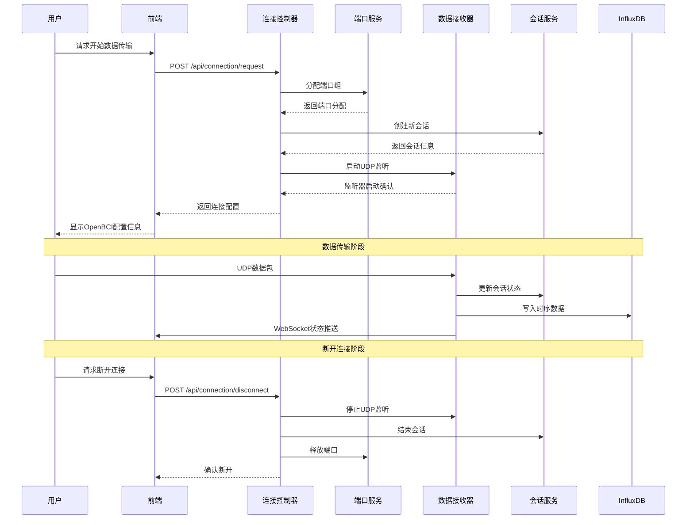
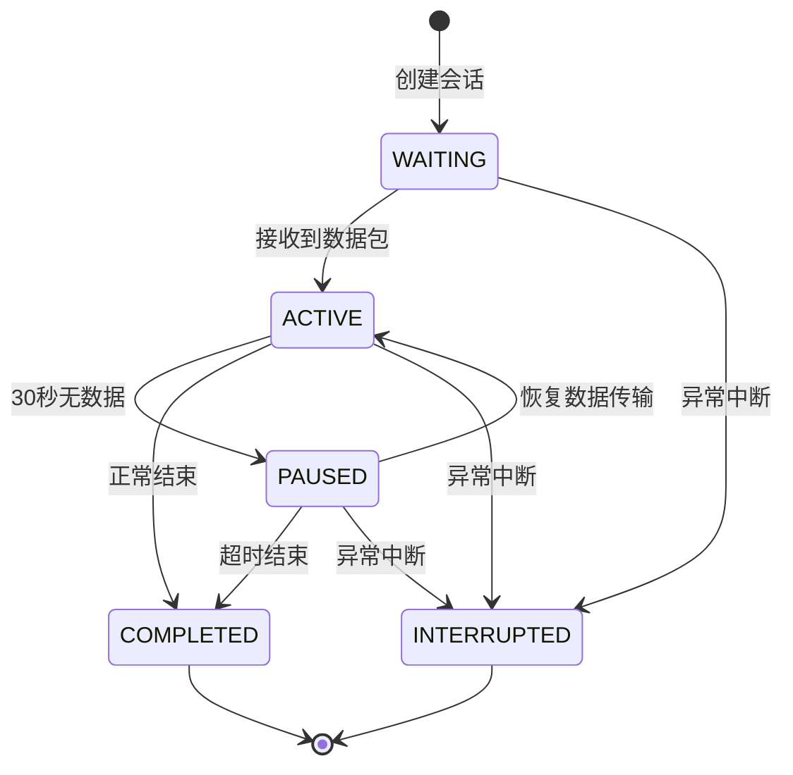
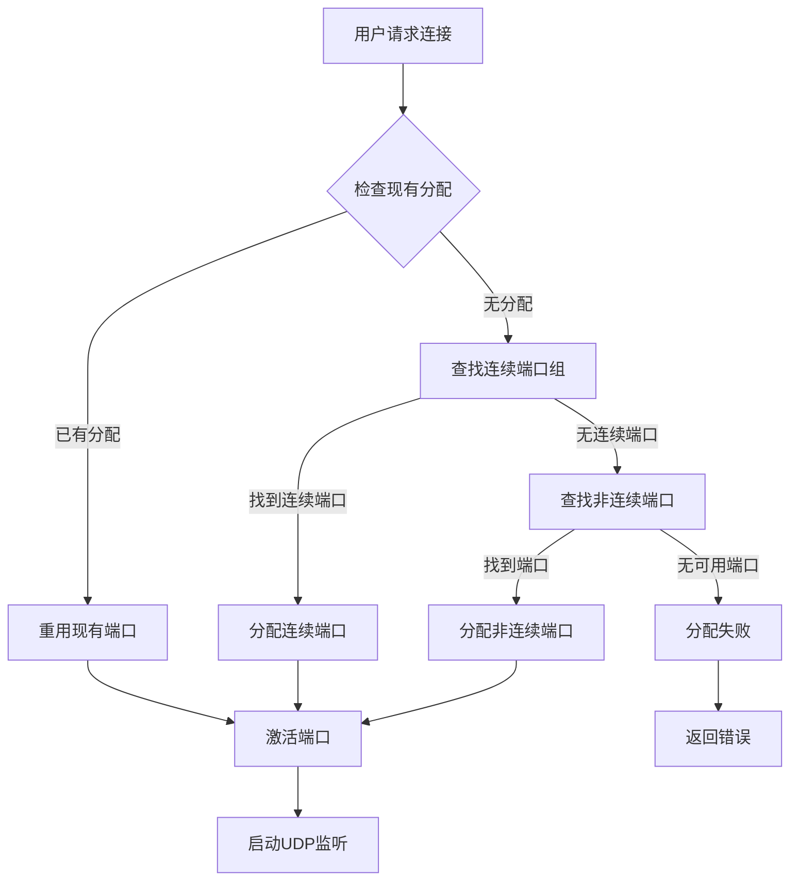
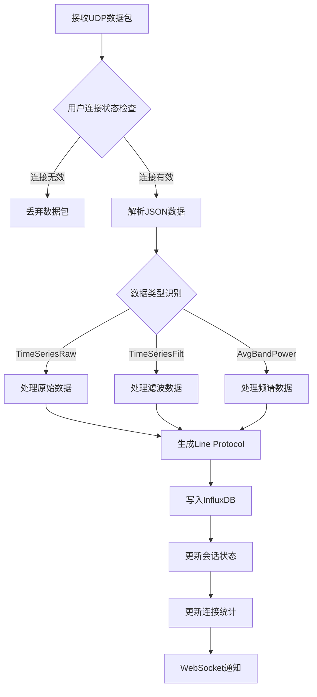

# 脑电数据传输与会话管理系统 - 开发需求文档

## 1. 项目背景与目标

### 1.1 项目背景

- **硬件环境：** OpenBCI_GUI v6.0.0 beta.1客户端
- **数据模式：** SYNTHETIC(algorithmic) 8通道模式
- **传输协议：** UDP网络协议
- **数据类型：** 三种脑电数据流（TimeSeriesRaw、TimeSeriesFilt、AvgBandPower）
- **数据库：** InfluxDB 3.2.1时序数据库
- **核心目标：** 构建支持多用户并发的脑电数据传输与会话管理平台，为后续AI大模型分析提供数据基础

### 1.2 模块目标

建立高性能、高可靠性的脑电数据传输系统，支持实时数据接收、存储、会话管理和状态监控，为用户提供完整的数据传输解决方案。

## 2. 功能需求规格

### 2.1 数据连接管理需求

**业务需求：**

- 支持用户申请脑电数据连接
- 动态分配UDP端口组（三个端口）
- 提供OpenBCI GUI配置指导
- 支持连接状态实时监控

**技术规格：**

- **连接申请接口：** `POST /api/connection/request`

- 请求头：

  ```json
  Content-Type: application/json
  ```

- 请求参数：

  ```json
  {
    "timezone": "string (用户时区，如 Asia/Shanghai)",
    "notes": "string (可选备注信息)"
  }
  ```

- 响应格式：

  ```json
  {
    "success": true,
    "message": "连接请求成功，数据传输会话已创建",
    "sessionId": "EEG-A1B2C3D4-1640995200000",
    "ip": "127.0.0.1",
    "ports": {
      "TimeSeriesRaw": 15001,
      "TimeSeriesFilt": 15002,
      "AvgBandPower": 15003
    },
    "timezone": "Asia/Shanghai",
    "allocatedAt": "2024-01-01T08:00:00",
    "instructions": {
      "step1": "在OpenBCI GUI中选择SYNTHETIC(algorithmic) 8chan模式",
      "step2": "选择Networking，协议设置为UDP",
      "step3": "在三个Stream中分别设置数据类型（必须按顺序）:",
      "stream1": "Stream 1: TimeSeriesRaw -> 端口 15001",
      "stream2": "Stream 2: TimeSeriesFilt -> 端口 15002",
      "stream3": "Stream 3: AvgBandPower -> 端口 15003",
      "step4": "将IP设置为 127.0.0.1",
      "step5": "点击START SESSION开始数据传输",
      "important": "注意：三个数据流的顺序和类型必须严格按照上述要求配置！"
    }
  }
  ```

**实现要求：**

- 用户身份验证（基于HttpSession）
- 时区智能处理和验证
- 端口池动态分配算法
- 会话ID生成和管理
- OpenBCI GUI配置自动生成

### 2.2 连接状态监控需求

**业务需求：**

- 实时监控连接状态
- 显示数据传输统计
- 提供系统资源使用情况
- 支持连接诊断功能

**技术规格：**

- **状态查询接口：** `GET /api/connection/status`

- 响应格式：

  ```json
  {
    "success": true,
    "hasActiveConnection": true,
    "hasActiveSession": true,
    "hasPortAllocation": true,
    "portAllocation": {
      "status": "ACTIVE",
      "rawPort": 15001,
      "filtPort": 15002,
      "bandPort": 15003,
      "allocatedAt": "2024-01-01T08:00:00",
      "lastUsedAt": "2024-01-01T08:05:00",
      "sessionId": "EEG-A1B2C3D4-1640995200000"
    },
    "connectionStatus": {
      "userId": 123,
      "rawConnected": true,
      "filtConnected": true,
      "bandConnected": true,
      "lastRawData": "2024-01-01T08:05:30",
      "lastFiltData": "2024-01-01T08:05:30",
      "lastBandData": "2024-01-01T08:05:30",
      "rawPacketCount": 15420,
      "filtPacketCount": 15418,
      "bandPacketCount": 1542,
      "connectionStartTime": "2024-01-01T08:00:00"
    },
    "packetCounts": {
      "raw": 15420,
      "filt": 15418,
      "band": 1542
    },
    "systemStatistics": {
      "activeConnections": 5,
      "activeSockets": 15,
      "activeRawStreams": 5,
      "activeFiltStreams": 5,
      "activeBandStreams": 5,
      "totalPacketsReceived": 162804
    }
  }
  ```

**实现要求：**

- 多维度状态聚合
- 实时数据包计数
- 连接健康检查
- 系统性能监控

### 2.3 连接断开管理需求

**业务需求：**

- 支持用户主动断开连接
- 自动资源清理和释放
- 会话状态同步更新
- 断开原因记录

**技术规格：**

- **断开连接接口：** `POST /api/connection/disconnect`

- 请求参数：

  ```json
  {
    "reason": "string (断开原因，可选)"
  }
  ```

- 响应格式：

  ```json
  {
    "success": true,
    "message": "连接已断开，会话已结束",
    "reason": "用户手动断开连接",
    "disconnectedAt": "2024-01-01T08:10:00"
  }
  ```

**实现要求：**

- 优雅的连接关闭流程
- UDP套接字资源释放
- 端口池资源回收
- 会话状态更新
- WebSocket通知推送

### 2.4 实时数据传输需求

**业务需求：**

- 支持三种脑电数据流并发传输
- 实时数据包接收和处理
- 数据完整性验证
- 传输性能监控

**技术规格：**

**数据流类型：**

1. **TimeSeriesRaw：** 原始8通道脑电时间序列数据
2. **TimeSeriesFilt：** 滤波处理的8通道脑电数据
3. **AvgBandPower：** 5个频段的平均功率数据

**数据格式：**

```json
// TimeSeriesRaw/TimeSeriesFilt数据格式
{
  "data": [
    [样本1_通道1, 样本2_通道1, ..., 样本10_通道1],
    [样本1_通道2, 样本2_通道2, ..., 样本10_通道2],
    // ... 8个通道
    [样本1_通道8, 样本2_通道8, ..., 样本10_通道8]
  ]
}

// AvgBandPower数据格式
{
  "data": [delta, theta, alpha, beta, gamma]
}
```

**存储规格：**

- **数据库：** InfluxDB 3.2.1
- **存储格式：** Line Protocol
- **时间精度：** 纳秒级
- **采样频率：** 250Hz（4ms间隔）

**实现要求：**

- UDP多端口并发监听
- JSON数据解析和验证
- InfluxDB时序数据写入
- 异常数据处理机制

### 2.5 会话管理需求

**业务需求：**

- 数据传输会话生命周期管理
- 多数据流状态独立跟踪
- 会话历史记录和查询
- 会话统计和分析

**技术规格：**

- **活跃会话查询：** `GET /api/sessions/active`
- **会话历史查询：** `GET /api/sessions/history?limit=10`
- **会话详情查询：** `GET /api/sessions/{sessionId}`
- **会话统计查询：** `GET /api/sessions/statistics`

**会话状态定义：**

```java
public enum SessionStatus {
    ACTIVE,      // 会话活跃中
    COMPLETED,   // 会话正常结束
    INTERRUPTED, // 会话被中断
    ERROR        // 会话异常
}

public enum StreamStatus {
    WAITING,     // 等待数据
    ACTIVE,      // 正在传输
    PAUSED,      // 暂停状态
    COMPLETED,   // 传输完成
    ERROR        // 传输错误
}
```

**实现要求：**

- 会话自动创建和管理
- 数据流状态实时更新
- 批量保存优化策略
- 会话超时自动清理

### 2.6 端口池管理需求

**业务需求：**

- 动态端口分配和释放
- 端口使用率监控
- 端口预留和超时管理
- 端口黑名单管理

**技术规格：**

- **端口范围：** 15001-65535
- **每用户端口数：** 3个（连续分配优先）
- **预留超时：** 30分钟
- **分配策略：** 连续分配 > 非连续分配

**端口池状态接口：** `GET /api/admin/ports/statistics`

```json
{
  "success": true,
  "totalPorts": 50535,
  "usedPorts": 15,
  "availablePorts": 50520,
  "activeAllocations": 5,
  "utilizationRate": 0.03
}
```

**实现要求：**

- 线程安全的端口分配
- 端口状态实时监控
- 自动超时清理机制
- 管理员强制释放功能

### 2.7 WebSocket实时通信需求

**业务需求：**

- 用户级WebSocket连接管理
- 实时状态变更通知
- 结构化消息推送
- 连接异常处理

**技术规格：**

- **连接端点：** `/ws/eeg?userId={userId}`
- **消息格式：**

```json
{
  "type": "CONNECTION_ESTABLISHED | SESSION_STARTED | SESSION_UPDATED | CONNECTION_CLOSED",
  "data": {},
  "timestamp": 1640995200000
}
```

**消息类型定义：**

- `CONNECTION_ESTABLISHED`：连接建立
- `SESSION_STARTED`：会话开始
- `SESSION_UPDATED`：会话状态更新
- `CONNECTION_STATUS_CHANGED`：连接状态变更
- `SESSION_ENDED`：会话结束
- `CONNECTION_CLOSED`：连接关闭

**实现要求：**

- 用户ID参数验证
- 会话映射管理
- 消息序列化处理
- 连接状态监控

## 3. 数据模型需求

### 3.1 EEG会话实体设计

**数据表：** `eeg_sessions`

**字段规格：**

```sql
CREATE TABLE eeg_sessions (
    id BIGINT AUTO_INCREMENT PRIMARY KEY,
    user_id BIGINT NOT NULL,
    session_start_time DATETIME NOT NULL,
    session_end_time DATETIME NULL,
    user_timezone VARCHAR(50) NULL,
    session_start_time_utc DATETIME NOT NULL,
    session_end_time_utc DATETIME NULL,
    session_status ENUM('ACTIVE', 'COMPLETED', 'INTERRUPTED', 'ERROR') NOT NULL DEFAULT 'ACTIVE',
    
    -- 原始数据流状态
    raw_stream_start_time_utc DATETIME NULL,
    raw_stream_end_time_utc DATETIME NULL,
    raw_stream_last_packet_time_utc DATETIME NULL,
    raw_stream_total_packets BIGINT DEFAULT 0,
    raw_stream_status ENUM('WAITING', 'ACTIVE', 'PAUSED', 'COMPLETED', 'ERROR') DEFAULT 'WAITING',
    
    -- 滤波数据流状态
    filt_stream_start_time_utc DATETIME NULL,
    filt_stream_end_time_utc DATETIME NULL,
    filt_stream_last_packet_time_utc DATETIME NULL,
    filt_stream_total_packets BIGINT DEFAULT 0,
    filt_stream_status ENUM('WAITING', 'ACTIVE', 'PAUSED', 'COMPLETED', 'ERROR') DEFAULT 'WAITING',
    
    -- 频谱数据流状态
    band_stream_start_time_utc DATETIME NULL,
    band_stream_end_time_utc DATETIME NULL,
    band_stream_last_packet_time_utc DATETIME NULL,
    band_stream_total_packets BIGINT DEFAULT 0,
    band_stream_status ENUM('WAITING', 'ACTIVE', 'PAUSED', 'COMPLETED', 'ERROR') DEFAULT 'WAITING',
    
    -- 会话元数据
    total_duration_seconds BIGINT NULL,
    raw_port INTEGER NULL,
    filt_port INTEGER NULL,
    band_port INTEGER NULL,
    notes TEXT NULL,
    
    created_at DATETIME DEFAULT CURRENT_TIMESTAMP,
    updated_at DATETIME DEFAULT CURRENT_TIMESTAMP ON UPDATE CURRENT_TIMESTAMP,
    
    INDEX idx_user_id (user_id),
    INDEX idx_session_status (session_status),
    INDEX idx_session_start_time_utc (session_start_time_utc),
    INDEX idx_created_at (created_at)
);
```

**特殊字段说明：**

- `session_start_time_utc`：UTC标准时间，用于精确的时间计算
- `user_timezone`：用户时区信息，用于前端时间显示
- `*_stream_*`：三个数据流的独立状态管理
- `total_duration_seconds`：会话总持续时间（秒）

### 3.2 索引需求

- **主键索引：** `id`
- **用户查询索引：** `user_id`
- **状态查询索引：** `session_status`
- **时间范围查询索引：** `session_start_time_utc`
- **创建时间索引：** `created_at`

## 4. 技术架构需求

### 4.1 框架要求

- **核心框架：** Spring Boot 3.x
- **数据访问：** Spring Data JPA
- **WebSocket：** Spring WebSocket
- **响应式编程：** Spring WebFlux WebClient
- **时序数据库：** InfluxDB 3.2.1

### 4.2 网络通信需求

**UDP通信：**

- **端口范围：** 15001-65535
- **缓冲区大小：** 8192字节
- **并发监听：** 支持多端口并发
- **超时处理：** 连接异常检测

**HTTP通信：**

- **超时配置：** 连接30秒，读取300秒
- **缓冲区：** 16MB内存缓冲
- **重试机制：** 最多3次重试

**WebSocket通信：**

- **连接管理：** 用户级会话映射
- **消息格式：** JSON结构化消息
- **异常处理：** 自动重连机制

### 4.3 性能需求

**数据处理性能：**

- **数据包处理速率：** > 250 packets/second
- **并发用户支持：** 100+用户同时连接
- **内存使用：** 单用户会话 < 10MB

**数据库性能：**

- **写入性能：** > 10,000 points/second
- **查询响应：** < 2秒（一般查询）
- **批量保存：** 每100个数据包或30秒间隔

**系统资源：**

- **CPU使用率：** < 70%（正常负载）
- **内存使用：** < 2GB（100用户）
- **磁盘IO：** 支持持续写入

### 4.4 时区处理需求

**时区标准化：**

- **存储标准：** 所有时间以UTC存储
- **用户时区：** 支持用户自定义时区
- **时区转换：** 前端负责显示转换
- **时区验证：** 服务端验证时区有效性

**时间精度：**

- **数据时间戳：** 纳秒级精度
- **会话时间：** 秒级精度
- **统计时间：** 分钟级精度

## 5. 业务流程需求

### 5.1 数据传输完整流程



### 5.2 会话状态管理流程



### 5.3 端口分配管理流程



### 5.4 数据包处理流程



## 6. 安全需求

### 6.1 身份认证

- **会话验证：** 基于HttpSession的用户身份验证
- **WebSocket认证：** URL参数userId验证
- **接口权限：** 所有API接口均需登录验证

### 6.2 数据安全

- **用户隔离：** 严格的用户级数据隔离
- **端口安全：** 端口分配和用户绑定验证
- **会话安全：** 防止会话劫持和数据泄露

### 6.3 资源保护

- **端口池保护：** 防止端口资源耗尽
- **连接限制：** 单用户连接数限制
- **内存保护：** 防止内存泄露和溢出

### 6.4 输入验证

- **数据格式验证：** JSON数据结构验证
- **参数验证：** 时区、端口号等参数验证
- **边界检查：** 数组索引和数据长度检查

## 7. 监控需求

### 7.1 系统监控指标

**连接监控：**

- 活跃连接数
- 数据包接收速率
- 连接异常率
- 端口使用率

**性能监控：**

- CPU和内存使用率
- 数据库写入性能
- WebSocket连接数
- 响应时间分布

**业务监控：**

- 用户会话数量
- 数据传输质量
- 会话平均时长
- 错误率统计

### 7.2 日志需求

**系统日志：**

- 应用启动和关闭日志
- 配置加载和验证日志
- 组件初始化日志

**业务日志：**

- 用户连接和断开日志
- 会话创建和结束日志
- 数据传输统计日志
- 异常和错误日志

**调试日志：**

- 数据包接收详情
- 会话状态变更记录
- 端口分配和释放记录

### 7.3 告警需求

**系统告警：**

- 端口池使用率 > 90%
- 内存使用率 > 80%
- 数据库连接异常
- 服务响应超时

**业务告警：**

- 数据包丢失率 > 5%
- 会话异常中断
- 用户连接失败
- 数据写入失败

## 8. 扩展需求

### 8.1 横向扩展能力

- **多实例部署：** 支持负载均衡部署
- **数据库集群：** 支持InfluxDB集群
- **缓存扩展：** 支持Redis分布式缓存
- **消息队列：** 支持异步消息处理

### 8.2 功能扩展能力

- **数据格式扩展：** 支持更多数据格式
- **协议扩展：** 支持TCP、WebSocket数据传输
- **设备扩展：** 支持更多脑电设备
- **分析扩展：** 为AI分析模块提供接口

### 8.3 监控扩展能力

- **指标收集：** 集成Prometheus监控
- **日志聚合：** 集成ELK日志系统
- **追踪系统：** 集成分布式追踪
- **告警系统：** 集成多渠道告警

## 9. 测试需求

### 9.1 单元测试

- **服务层测试：** 覆盖率 > 80%
- **工具类测试：** 覆盖率 > 90%
- **数据访问层测试：** 覆盖率 > 85%

### 9.2 集成测试

- **API接口测试：** 所有接口功能验证
- **数据库集成测试：** 数据一致性验证
- **WebSocket测试：** 实时通信功能验证

### 9.3 性能测试

- **负载测试：** 100并发用户测试
- **压力测试：** 系统极限性能测试
- **稳定性测试：** 24小时连续运行测试

### 9.4 安全测试

- **身份验证测试：** 认证机制安全验证
- **数据隔离测试：** 用户数据隔离验证
- **输入验证测试：** 恶意输入防护测试

## 10. 部署需求

### 10.1 环境配置

- **JDK版本：** OpenJDK 17+
- **数据库：** MySQL 8.0+ （会话数据）
- **时序数据库：** InfluxDB 3.2.1
- **内存要求：** 最少4GB可用内存

### 10.2 配置文件

**application.yml关键配置：**

```yaml
# 端口池配置
eeg:
  port-pool:
    start: 15001
    end: 65535
    ports-per-user: 3
    reservation-timeout-minutes: 30

# InfluxDB配置
influxdb:
  url: http://localhost:8181
  token: your_influxdb_token

# 数据库配置
spring:
  datasource:
    url: jdbc:mysql://localhost:3306/eeg_platform
    username: root
    password: your_password

# 时区配置
spring:
  jpa:
    properties:
      hibernate:
        jdbc:
          time_zone: UTC
```

### 10.3 监控配置

- **端点监控：** `/actuator/health`, `/actuator/metrics`
- **日志配置：** 分级日志输出配置
- **性能监控：** JVM和应用性能指标

### 10.4 运维需求

- **备份策略：** 数据库定期备份
- **日志轮转：** 日志文件大小和时间控制
- **监控告警：** 关键指标监控和告警
- **故障恢复：** 服务自动重启和故障转移

## 11. 验收标准

### 11.1 功能验收

- [ ] 用户能够成功申请数据连接并获得端口配置
- [ ] 系统能够同时处理100个并发用户连接
- [ ] 三种数据流能够正确接收、解析和存储
- [ ] 会话状态能够实时更新和查询
- [ ] WebSocket能够正确推送状态变更通知

### 11.2 性能验收

- [ ] 数据包处理速率 > 250 packets/second
- [ ] API响应时间 < 2秒（95%请求）
- [ ] 系统能够稳定运行24小时以上
- [ ] 内存使用率 < 2GB（100用户）

### 11.3 安全验收

- [ ] 未授权用户无法访问任何API接口
- [ ] 用户只能访问自己的数据和会话
- [ ] 系统能够防护常见的安全攻击
- [ ] 敏感信息不会泄露到日志中

### 11.4 稳定性验收

- [ ] 系统能够正确处理网络异常
- [ ] 能够优雅地处理用户异常断开
- [ ] 资源能够正确回收和释放
- [ ] 无内存泄露和死锁问题