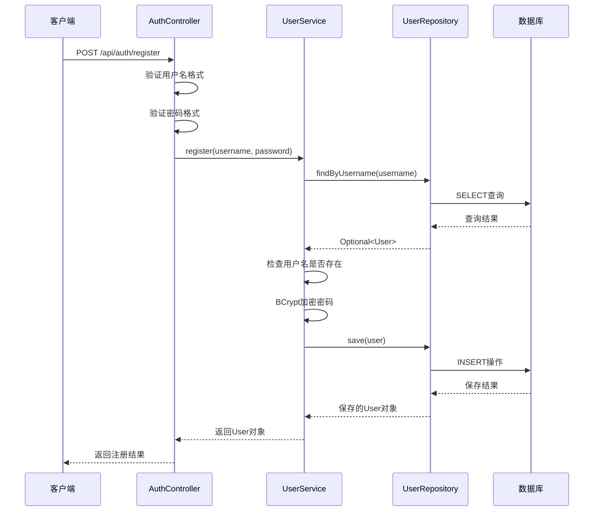
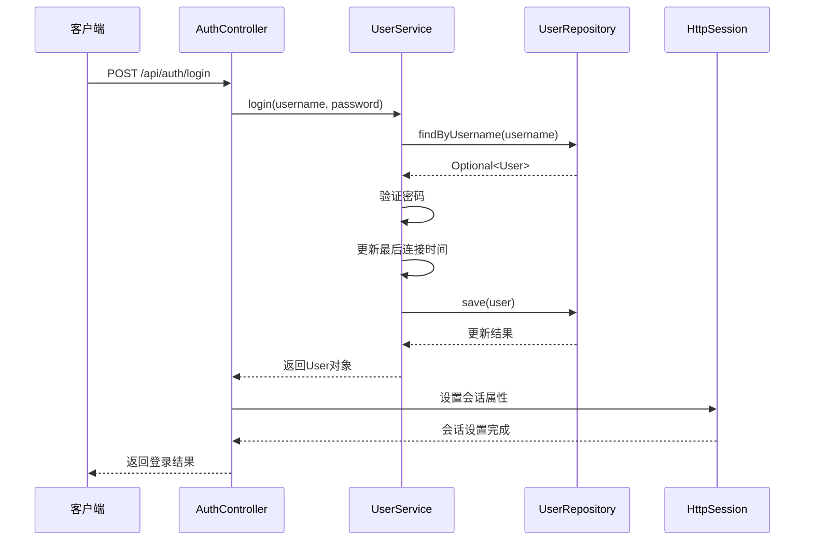
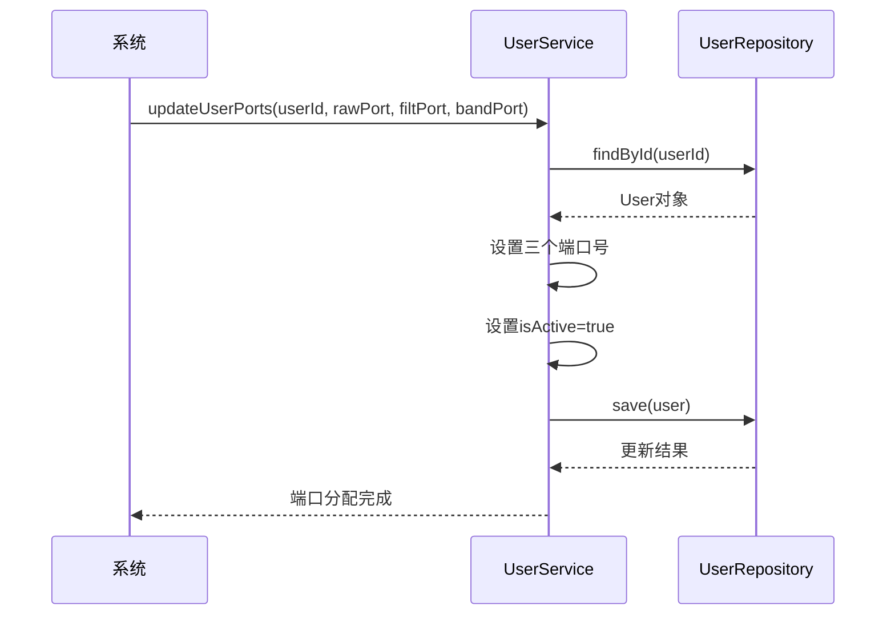

# 脑电数据分析系统 - 用户认证模块开发需求文档

## 1. 项目背景与目标

### 1.1 项目背景

- **硬件环境：** OpenBCI_GUI v6.0.0 beta.1客户端
- **数据模式：** SYNTHETIC(algorithmic) 8通道模式
- **传输协议：** UDP网络协议
- **数据类型：** 三种脑电数据流（TimeSeriesRaw、TimeSeriesFilt、AvgBandPower）
- **数据库：** InfluxDB 3.2.1时序数据库
- **核心目标：** 构建AI大模型集成MCP服务的脑电数据分析平台

### 1.2 模块目标

建立安全可靠的用户认证体系，为脑电数据的个性化处理和AI分析提供用户级别的身份管理和数据隔离基础。

## 2. 功能需求规格

### 2.1 用户注册需求

**业务需求：**

- 支持新用户账户创建
- 确保用户名唯一性
- 实现密码安全存储
- 提供输入验证和错误提示

**技术规格：**

- **接口路径：** `POST /api/auth/register`

- 请求头：

  ```json
  Content-Type：application/json
  ```

- 请求参数：

  ```json
  {  "username": "string (6-20位字母数字)",  "password": "string (8-30位，含字母数字)"}
  ```

- 验证规则：

  - 用户名：`^[a-zA-Z0-9]{6,20}$`
  - 密码：`^(?=.*[A-Za-z])(?=.*\\d)[A-Za-z\\d@$!%*?&]{8,30}$`

- 响应格式：

  ```json
  {  "message": "注册成功",  "userId": "long",  "username": "string"}
  ```

**实现要求：**

- 使用BCrypt算法加密密码
- 数据库唯一性约束检查
- 事务性操作确保数据一致性
- 详细的错误信息返回

### 2.2 用户登录需求

**业务需求：**

- 验证用户身份信息
- 建立用户会话
- 记录登录时间
- 支持会话状态管理

**技术规格：**

- **接口路径：** `POST /api/auth/login`

- 请求参数：

  ```json
  {  "username": "string",  "password": "string"}
  ```

- **会话管理：** HttpSession存储用户信息

- 实例账户：

  ```json
  {
      "username": "test123456", 
      "password": "test123456"
    }
  ```

- 响应格式：

  ```json
  {  "message": "登录成功",  "userId": "long",  "username": "string"}
  ```

**实现要求：**

- 密码BCrypt验证
- 会话信息设置（userId, username）
- 最后连接时间更新
- 登录日志记录

### 2.3 用户登出需求

**业务需求：**

- 安全退出用户会话
- 释放服务器资源
- 清除敏感信息

**技术规格：**

- **接口路径：** `POST /api/auth/logout`
- **操作：** 销毁当前HttpSession
- **响应：** 确认消息

### 2.4 认证状态查询需求

**业务需求：**

- 检查当前登录状态
- 获取当前用户信息
- 支持前端状态同步

**技术规格：**

- **接口路径：** `GET /api/auth/status`

- 响应格式：

  ```json
  {  "authenticated": "boolean",  "userId": "long (可选)",  "username": "string (可选)"}
  ```

## 3. 数据模型需求

### 3.1 用户实体设计

**数据表：** `users`

**字段规格：**

```sql
CREATE TABLE users (
    id BIGINT AUTO_INCREMENT PRIMARY KEY,
    username VARCHAR(20) UNIQUE NOT NULL,
    password VARCHAR(255) NOT NULL,
    raw_port INTEGER,
    filt_port INTEGER, 
    band_port INTEGER,
    is_active BOOLEAN DEFAULT FALSE,
    last_connection DATETIME,
    created_at DATETIME DEFAULT CURRENT_TIMESTAMP,
    updated_at DATETIME DEFAULT CURRENT_TIMESTAMP ON UPDATE CURRENT_TIMESTAMP
);
```

**特殊字段说明：**

- `raw_port`：TimeSeriesRaw数据UDP端口
- `filt_port`：TimeSeriesFilt数据UDP端口
- `band_port`：AvgBandPower数据UDP端口
- `is_active`：数据传输活跃状态标识

### 3.2 索引需求

- 主键索引：`id`
- 唯一索引：`username`
- 普通索引：`is_active`, `last_connection`

## 4. 技术架构需求

### 4.1 框架要求

- **核心框架：** Spring Boot 3.x
- **数据访问：** Spring Data JPA
- **安全组件：** Spring Security BCrypt
- **Web组件：** Spring Web MVC
- **数据库：** 兼容JPA的关系型数据库

### 4.2 依赖组件

- **密码加密：** BCryptPasswordEncoder
- **JSON处理：** Jackson ObjectMapper
- **日志框架：** SLF4J + Logback
- **lombok：** 减少模板代码

### 4.3 配置需求

**Web配置：**

- 静态资源映射：`/**` → `classpath:/static/`
- 默认页面：`/` → `/index.html`
- CORS配置：允许`/api/**`跨域访问

**JPA配置：**

- 实体包扫描：`com.eeg.entity`
- 仓库包扫描：`com.eeg.repository`
- 自动DDL：开发环境使用`create-drop`或`update`

## 5. 业务流程需求

### 5.1 用户注册流程



### 5.2 用户登录流程



### 5.3 端口分配流程



## 6. 安全需求

### 6.1 密码安全

- **加密算法：** BCrypt with random salt
- **强度要求：** 最少8位，包含字母和数字
- **存储安全：** 明文密码不得存储或传输

### 6.2 会话安全

- **会话超时：** 配置合理的超时时间
- **会话销毁：** 登出时完整清理会话数据
- **并发控制：** 同一用户多会话管理策略

### 6.3 输入验证

- **SQL注入防护：** 使用参数化查询
- **XSS防护：** 输入数据转义处理
- **格式验证：** 正则表达式严格验证

## 7. 性能需求

### 7.1 响应时间

- **注册接口：** < 2秒
- **登录接口：** < 1秒
- **状态查询：** < 500ms

### 7.2 并发支持

- **同时在线用户：** 支持100+并发用户
- **数据库连接：** 配置连接池优化
- **会话管理：** 支持集群化部署

### 7.3 资源使用

- **内存占用：** 单用户会话 < 1MB
- **数据库查询：** 优化索引减少查询时间
- **WebSocket连接：** 支持持久连接管理

## 8. 扩展需求

### 8.1 实时通信支持

- **WebSocket管理：** 用户级会话映射
- **消息推送：** 结构化消息格式
- **连接监控：** 连接状态实时跟踪

### 8.2 多数据流支持

- **端口管理：** 动态端口分配机制
- **状态同步：** 用户活跃状态实时更新
- **资源隔离：** 用户间数据通道独立

### 8.3 AI集成准备

- **用户关联：** 为AI分析提供用户标识
- **数据权限：** 基于用户的数据访问控制
- **结果推送：** 支持分析结果个性化推送

## 9. 测试需求

### 9.1 单元测试

- 用户服务层业务逻辑测试
- 密码加密解密功能测试
- 数据访问层CRUD操作测试

### 9.2 集成测试

- API接口功能完整性测试
- 数据库事务一致性测试
- 会话管理机制测试

### 9.3 安全测试

- 密码安全性测试
- SQL注入攻击测试
- 会话劫持防护测试

## 10. 部署需求

### 10.1 环境配置

- **JDK版本：** OpenJDK 17+
- **数据库：** MySQL 8.0+ 或 PostgreSQL 13+
- **内存要求：** 最少2GB可用内存

### 10.2 配置文件

- **数据库连接：** 生产环境连接配置
- **会话配置：** 超时和安全设置
- **日志配置：** 生产级别日志输出

### 10.3 监控需求

- **接口调用监控：** 响应时间和成功率
- **用户活跃监控：** 在线用户数量统计
- **错误监控：** 异常和错误日志收集